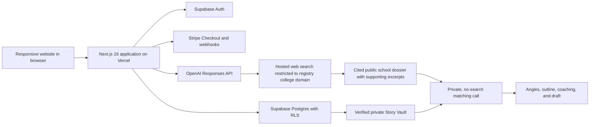

# Spec: StoryBridge Web MVP

Status: Approved for implementation planning  
Owner: Miles Drake  
Last updated: 2026-08-02  
Target: Closed production beta for at most 25 invited users within seven calendar days of implementation start

## 1. Objective

StoryBridge is a web-first AI college-essay coach for students who cannot afford a private admissions advisor. It interviews a student once, converts verified answers into a reusable Story Vault, researches each college using official sources, recommends personalized supplemental-essay angles, guides outlining and drafting, and provides contextual revision help.

The product is coaching-first. Full-draft generation exists only as a clearly labeled fallback after angle selection and outlining. The product never promises admission, invents student experiences, or markets AI output as original student work.

### Product promise

> We help you discover what only you can say—and express it convincingly to this particular school.

### Primary user

An English-speaking US college applicant, age 18 or older during the closed beta, who is applying through Common App, has a developing college list, and wants high-quality supplemental-essay help without the cost of a private advisor. Applicants aged 16–17 remain the intended audience after a separate minor-consent and privacy review; they are not eligible for the seven-day beta.

### Jobs to be done

- When I face a school-specific prompt, help me identify the strongest truthful story to tell.
- Help me connect my experiences to real opportunities at that school without sounding generic.
- Coach me through writing and revising while preserving my voice.
- When I am completely stuck, give me a transparent reference draft that I can substantially revise.

### Business objective

Validate that students will complete the interview, prefer the resulting strategy and coaching over generic AI, finish an essay, and pay for additional essay workspaces.

## 2. Scope

### Included in the MVP

- Responsive web application optimized for laptop use
- Email magic-link authentication
- One fixed 8–10 question interview and reusable, editable Student Story Vault
- Manual prompt and word-limit entry for a school selected from a server-owned registry of at least 10 pre-verified institutions
- Official-domain school research with visible citations
- Three personalized essay angles per prompt
- Guided outline creation
- Autosaving plain-text essay editor
- Contextual coaching, sentence continuation, and selected-snippet rewriting
- One labeled full-draft fallback per essay after an outline exists
- Final factual review and plain-text copy/export
- First essay free
- Paid application-season entitlement through Stripe Checkout
- Privacy controls, data export, and account deletion
- Essential product, cost, and reliability analytics without essay content
- Closed-beta invitation and global spend caps

### Explicitly excluded

- Common App personal statements
- College-list creation or admissions strategy
- Admissions predictions or guarantees
- Common App login, import, scraping, or submission
- Automatically maintained school/prompt database
- Human advisor marketplace
- Collaboration, sharing, comments, or public user-generated content
- Native iOS, Android, macOS, or Windows applications
- Offline essay editing
- Installable PWA behavior
- Arbitrary user-supplied college domains
- Rich-text formatting
- Streaming AI responses
- Non-English output
- Applicants younger than 18 during the closed beta

## 3. Product Principles and Integrity Boundary

1. **Student ownership:** Coaching and guided writing are the default experience.
2. **Truth over polish:** The system may reorganize or clarify facts but may not invent them.
3. **Evidence before personalization:** Public school research and private student matching are separate operations.
4. **Visible provenance:** School claims display clickable citations; AI-generated passages are visibly labeled.
5. **Progressive assistance:** Brainstorming precedes outlining, outlining precedes drafting, and full generation is last.
6. **No admissions claims:** Success is a completed, authentic deliverable—not acceptance.

Common App identifies intentionally misrepresenting substantive AI output as one's own original work as potential application fraud. StoryBridge must therefore describe its fallback as a reference draft, require student review, and advise users to follow each institution's policy. See the [Common App Fraud Policy](https://www.commonapp.org/files/Common-App-Fraud-Policy.pdf).

## 4. Core User Experience

### 4.1 First session

1. The visitor sees the product promise, responsible-use summary, pricing, and sample workflow.
2. The visitor creates an account through an emailed magic link.
3. The user confirms they are at least 18 and accepts the Terms, Privacy Policy, and Responsible Use Policy.
4. The app explains that the interview takes approximately 10–15 minutes and can be resumed.
5. The interview asks 8–10 fixed questions, with at most two targeted follow-ups, about interests, experiences, activities, responsibilities, values, ambitions, challenges, accomplishments, and writing voice.
6. The app extracts a structured Story Vault.
7. The user reviews every extracted fact, corrects inaccuracies, marks facts verified, and can suppress sensitive topics.

### 4.2 New essay

1. The user enters the college name.
2. The user selects a school from the server-owned verified registry. Users cannot override its official domain; an unsupported school can be requested for later operator review.
3. The user pastes only the supplemental prompt and enters its word limit. The UI warns not to paste an essay, notes, names, contact details, or other personal information.
4. The server classifies and redacts the prompt for accidental personal data. School research receives the school name, verified domain, and a server-defined research rubric only; the raw or redacted prompt is never sent to web search.
5. The research screen shows summarized opportunities and clickable sources.
6. A separate, non-search model call matches the sourced dossier to verified Story Vault facts.
7. The app proposes three materially different essay angles.
8. The user selects or edits one angle.
9. The app proposes a section-level outline; the user edits and confirms it.
10. The editor opens with prompt, word count, outline, research, and coach available.

### 4.3 Writing and revision

- The student writes directly in the editor.
- Autosave runs after 750 ms of inactivity. Window blur flushes the same queued save rather than creating a second concurrent save.
- The coach may answer questions about structure, specificity, evidence, prompt fit, school fit, and voice.
- When text is selected, the user may request: clarify, tighten, expand, strengthen evidence, improve transition, preserve voice, or custom instruction.
- “Help me continue” returns up to three possible next sentences, never silently inserts one.
- Every generated suggestion is persisted as an immutable proposal, previewed as a diff, and requires a server-enforced acceptance command.
- The final review identifies unsupported factual claims, missing prompt coverage, word-limit violations, generic school language, and voice shifts.

### 4.4 Full-draft fallback

The fallback button is available only when:

- a Story Vault exists;
- the current essay has a selected angle;
- the outline has at least three non-empty sections; and
- the user acknowledges that the output is a reference draft requiring substantial revision.

The fallback:

- may use only verified Story Vault facts and cited school facts;
- is displayed in a separate read-only `AI reference draft` panel;
- is atomically reserved and generated at most once per essay in the beta;
- cannot be inserted into, accepted as, copied through, or exported as the student's draft by an application action;
- requires the student to confirm each factual claim before final export; and
- triggers a final reminder to follow the target institution's AI policy.

If the student's editable draft is substantially similar to the reference draft, export is blocked and the app requests meaningful revision. Similarity is a harm-reduction control, not proof of authorship; StoryBridge cannot prevent a user from copying text outside the product.

For the beta, `substantially similar` is deterministic: normalize both texts with Unicode NFKC, lowercase, replace punctuation with spaces, collapse whitespace, and tokenize on spaces. For texts of at least 40 tokens, block export if either (a) at least 45% of the reference draft's distinct four-token n-grams occur in the student draft or (b) the longest contiguous matching sequence is at least 30 tokens. Below 40 reference tokens, block only when normalized texts are identical. The audit returns the measured values and threshold code; calculation failure fails closed with `503 SERVICE_UNAVAILABLE` and never sends either text to another provider.

## 5. Functional Requirements

### FR-1 Authentication and consent

- Users can request and redeem a single-use email magic link.
- Authenticated sessions use secure, HTTP-only cookies managed through Supabase SSR.
- Protected routes redirect unauthenticated users to sign in.
- Consent records store policy version and timestamp.
- Every coaching/product API checks the server-side eligibility gate: accepted invitation, authenticated user, `age_confirmed_at` present, age 18+, and current policy versions accepted. Consent bootstrap, data export, and account deletion use the narrower exceptions in Section 11 so users cannot be locked out of privacy rights.
- Magic-link requests return the same HTTP 202 response whether or not an account exists and are rate-limited by normalized-email HMAC and IP HMAC.
- Users can sign out, export their data, and delete their account in-app.

**Acceptance:** A user can sign in on a new browser, resume their Story Vault, sign out, and permanently initiate deletion without staff assistance.

### FR-2 Interview

- The beta interview contains 8–10 fixed questions with at most two targeted follow-ups.
- Answers autosave after each turn.
- Users can pause and resume.
- The model must not infer sensitive facts as true; inferred possibilities must be asked as questions.
- The interview is complete when minimum coverage exists for academic interests, two experiences, values, goals, and voice.

**Acceptance:** Closing the browser after any answer and returning preserves the complete transcript and current question.

### FR-3 Story Vault

- The vault stores structured facts grouped by academics, activities, responsibilities, experiences, values, goals, voice, and excluded topics.
- Each fact stores its source interview-message IDs and verification status.
- Unverified facts cannot be used in full-draft generation.
- A user can suppress any fact. Suppressed facts remain visible in the Story Vault/export but are excluded by repository query—not prompt instruction—from every matching, coaching, generation, and audit context until restored.
- Editing a fact atomically sets `verification_status = unverified` and `verified_at = null` until reconfirmed.
- Deleting a fact removes it from future AI contexts.

**Acceptance:** Every factual sentence in a fallback draft can be traced to at least one verified Story Vault item or cited school source.

### FR-4 School and prompt setup

- The user selects a school from a server-owned registry. Each registry entry contains a canonical name, official domain, verification source, verifier, and verification timestamp.
- Only an operator can create or change a registry domain; user corrections create a review request and never immediately affect research.
- Prompt text and a word limit are required. Prompt text is limited to 2,000 characters.
- Before persistence or any AI use, the prompt passes a personal-data heuristic. Suspected essays, contact data, or autobiographical notes require user correction; they are never sent to web search.
- The stored prompt remains private application data.

**Acceptance:** No research begins for an unregistered school, and captured tests prove prompt text never appears in a web-search payload.

### FR-5 School research

- Research uses OpenAI Responses API web search with the registry domain in `allowed_domains`.
- The request contains only canonical school name, verified domain, and a server-owned rubric. It never contains prompt text, Story Vault data, draft text, user identity, or private profile data.
- Results use Structured Outputs and include normalized source URL, title, retrieved timestamp, claim, relevance category, and a supporting source excerpt of at most 300 characters.
- Only claims whose cited excerpt textually supports the claim and whose final normalized URL remains on the registry domain may enter the dossier.
- Citations are clickable wherever a research claim is shown.
- Research can be refreshed only after an explicit warning that prior angles, outline, and pending proposals will be invalidated. The refresh atomically rebinds the essay to the new dossier and resets those dependent artifacts. Prior dossier versions preserve claim, short supporting excerpt, normalized URL, retrieval timestamp, and a keyed content fingerprint; this is provenance evidence, not an immutable copy of the source page.

**Acceptance:** Automated tests fail the request if any private field or prompt text is present in the search payload, if a URL leaves the registry domain, or if any displayed claim lacks a supporting excerpt and citation.

### FR-6 Angle generation

- Exactly three distinct angles are returned unless the model refuses or insufficient profile evidence exists.
- Each angle contains thesis, verified student evidence IDs, school-source IDs, prompt-fit explanation, and cliché/weakness warning.
- The model may say evidence is insufficient and ask one targeted follow-up question.
- Users can select, edit, or regenerate angles once per essay without support intervention.

**Acceptance:** Every angle references at least one verified student fact and one cited school fact when the prompt is school-specific.

### FR-7 Outline

- The outline contains an opening purpose, 2–4 body beats, school connection, and closing purpose.
- Each section includes target word allocation and linked evidence IDs.
- Total target words must be within 10% of the prompt limit.
- Users can reorder, edit, add, and remove sections.

**Acceptance:** The system prevents fallback generation until the outline gate is satisfied.

### FR-8 Editor and autosave

- The editor supports plain text, paragraph breaks, and browser undo/redo. Rich-text formatting is excluded.
- The canonical persisted format is normalized UTF-8 plain text with LF line endings.
- Word count updates locally.
- Autosave displays `Saving`, `Saved`, `Conflict`, or `Save failed` and uses the revision/ETag contract in Section 11.
- Draft versions are created before accepted AI rewrites or continuations. The read-only reference draft is versioned separately and is never inserted.

**Acceptance:** A simulated network failure never replaces a newer local draft with an older server draft.

### FR-9 Coaching and revision

- Coaching calls receive the prompt, selected angle, outline, current draft, verified Story Vault subset, and school dossier subset.
- Responses are advice-first and cannot modify the draft directly.
- Snippet rewrites and continuations create immutable `ai_proposals` containing original-text hash, proposed text, rationale, evidence links, expiration, and target essay revision.
- “Help me continue” returns one to three suggestions totaling no more than 100 words.
- Suggestions must preserve first-person perspective and stated voice constraints.

**Acceptance:** Only `POST /api/v1/essays/{essayId}/proposals/{proposalId}/accept` may apply AI proposal text. It atomically verifies ownership, proposal status, selection hash, target revision, evidence, and explicit user action before creating a new essay version.

### FR-10 Final review and export

- The review checks word count, prompt coverage, factual support, school citations, repeated/general language, reference-draft similarity, and voice consistency.
- Each issue has severity, explanation, and recommended action.
- Unsupported factual claims block export until removed or linked to verified evidence. After fallback generation, the user decides each immutable reference claim; confirmed claims remain confirmed across draft edits, while a rejected claim must be absent from the current student draft before export.
- Export is plain-text copy to clipboard and `.txt` download.

**Acceptance:** The export endpoint returns only the student's editable draft after evidence and similarity gates pass. The read-only reference draft is never returned by an export or proposal-acceptance endpoint.

### FR-11 Payments and entitlements

- The free entitlement permits one essay workspace per account per season and one fallback generation. Deleting the essay does not restore the free allowance.
- The beta season pass defaults to USD $24.99, configurable without code changes.
- The paid entitlement permits up to 20 essay workspaces during the 2026–2027 application season.
- Stripe-hosted Checkout collects payment.
- Checkout creation requires an idempotency key and reuses an existing open Checkout Session for the same user and season.
- Access is granted only from a verified `checkout.session.completed` webhook after validating event ID, live/test mode, payment status, amount, currency, price ID, season, and user binding; never from the success redirect.
- Webhook event recording, validation, and entitlement transition occur in one database transaction keyed by unique Stripe event ID.
- Checkout expiration grants nothing. Refund and dispute events transition the entitlement to terminal `REFUNDED` or `REVOKED` states; delayed completion events cannot reactivate either state.

**Acceptance:** Concurrent or replayed webhooks commit at most one entitlement transition; mismatched valid events grant nothing and generate a content-free operator alert.

### FR-12 Usage controls

- Rate limits apply by authenticated user and a rotating, keyed IP HMAC retained for at most 24 hours.
- Default beta limits: 50 AI calls/day, 3 school research refreshes/day, 1 fallback/essay, 20 essays/paid season.
- Limits are configuration values. A 25-account beta cap and hard monthly OpenAI spend ceiling stop new invitations or AI reservations when reached.
- Every billable or limited action first creates an atomic operation reservation with a required idempotency key. Concurrent reservations count against the same quota; retries return the original operation/result.
- Failed-before-provider reservations are released; provider-started, refused, timed-out, or unknown-outcome calls consume quota to prevent retry amplification.
- Every AI call records purpose, model, token counts, latency, success/failure, and estimated cost—never raw essay content.

**Acceptance:** Exceeding a limit returns HTTP 429 with `Retry-After` and `RateLimit-*` headers, an RFC 3339 UTC reset time, and no OpenAI request. Concurrent tests cannot exceed user, IP, fallback, essay, cohort, or spend limits.

## 6. UX and Accessibility Requirements

### Primary screens

- Landing, invitation, sign-in, consent, and responsible-use flow
- Interview and Story Vault review flow
- Essay dashboard and new-essay setup
- Combined school research, angle, and outline workspace
- Essay editor with coach and read-only reference panel
- Final review and export
- Billing, settings, data export, and deletion

### Layout

- Optimize the editor for 1280–1440 px laptop widths.
- At desktop widths, use a centered editor with collapsible outline/research panel and coach panel.
- At widths below 768 px, panels become tabs or sheets; all core functions remain available.
- Do not require horizontal scrolling at 320 px.

### Accessibility

- Meet WCAG 2.2 AA for keyboard navigation, focus visibility, semantics, color contrast, labels, and error communication.
- All asynchronous AI status changes use appropriate ARIA live regions without excessive announcements.
- Reduced-motion preferences disable nonessential animation.

### Browser behavior

- The beta is an online-only responsive website, not an installable PWA.
- Authenticated pages and API responses send `Cache-Control: private, no-store`.
- Show an online-required message if an AI or persistence action is attempted offline.

## 7. System Architecture



### Trust boundaries

- The browser receives only the Supabase publishable key.
- OpenAI and Stripe secret keys exist only in server environment variables.
- Supabase secret/service keys exist only in webhook/admin server code.
- Public research requests never contain private user data.
- Public research requests never contain the student's prompt.
- AI requests use a stable pseudonymous user identifier derived by keyed HMAC as `safety_identifier`.
- OpenAI requests set `store: false`.
- Analytics events exclude answer, profile, prompt, research excerpt, and essay text.

## 8. Technical Stack

- **Runtime:** Node.js 24 LTS
- **Language:** TypeScript 5.x, strict mode
- **Framework:** Next.js 16.2.x Active LTS using App Router; pin at or above 16.2.11 and commit the lockfile
- **UI:** React 19.x, Tailwind CSS 4.x, accessible headless primitives only where needed
- **Validation:** Zod
- **Editor:** Controlled plain-text textarea with local recovery buffer; no editor framework in the beta
- **Auth/database:** Supabase Auth, Postgres, `@supabase/supabase-js`, and `@supabase/ssr`
- **AI:** OpenAI Node SDK and Responses API
- **Default model:** `gpt-5.6-terra` for balanced quality and cost, configurable through `OPENAI_MODEL`
- **AI structure:** Zod-backed Structured Outputs
- **School research:** Responses API `web_search` with `filters.allowed_domains`
- **Moderation:** `omni-moderation-latest` inline moderation signals, interpreted by application policy
- **Payments:** Stripe-hosted Checkout in one-time payment mode plus signed webhooks
- **Deployment:** Vercel for Next.js; hosted Supabase project for Auth/Postgres
- **Testing:** Vitest, React Testing Library, Playwright, pgTAP
- **Formatting/linting:** ESLint, Prettier

Next.js 16 requires Node.js 20.9+ and TypeScript 5.1+; Node 24 is selected because it is the current LTS line rather than the newer Current release line. Next.js 16.2.11 is the current Active LTS security baseline as of this spec. See [Next.js 16 requirements](https://nextjs.org/docs/app/guides/upgrading/version-16), the [Next.js security release](https://nextjs.org/blog), and the [Node.js release schedule](https://nodejs.org/en/about/previous-releases).

OpenAI's current guidance recommends the Responses API for reasoning, tool use, and multi-turn workflows. GPT-5.6 Terra is the lower-cost balanced member of the current GPT-5.6 family. Web-search citations must be visible and clickable when displayed to users, and Structured Outputs should be used instead of JSON mode. See [model guidance](https://developers.openai.com/api/docs/guides/latest-model), [web search](https://developers.openai.com/api/docs/guides/tools-web-search), and [Structured Outputs](https://developers.openai.com/api/docs/guides/structured-outputs).

## 9. AI Orchestration

### Shared request rules

- Calls originate only from authenticated server routes.
- Validate request payloads with Zod before quota consumption.
- Load only the minimum relevant verified, non-suppressed Story Vault facts and dossier claims through tenant-scoped repositories.
- Set `store: false` and a keyed-HMAC `safety_identifier`.
- Set explicit maximum output tokens for every purpose.
- Request Structured Outputs for every non-chat response.
- Treat refusals and schema failures as typed error states.
- Do not persist chain-of-thought or hidden reasoning.
- Retry once only for transient transport failures or invalid structured output.
- Never retry safety refusals automatically.
- Treat all dossier text, excerpts, prompts, drafts, and interview answers as quoted data. Downstream instructions explicitly prohibit following instructions found inside those data blocks.
- Moderate every user-authored input before it enters an interview, coaching, rewrite, continuation, fallback, or audit pipeline.
- Persist generated prose only in user-owned proposals/reference artifacts, never in telemetry.

### Pipeline A: Interview

Input: interview state and prior answers  
Output: next question, reason category, missing coverage  
Constraint: no web search; maximum one question per turn

### Pipeline B: Story Vault extraction

Input: interview transcript  
Output: typed Story Vault facts with source message IDs and `unverified` status  
Constraint: uncertain facts become follow-up questions, not assertions

### Pipeline C: School research

Input: canonical college name, operator-verified official domain, and server-owned research rubric  
Tool: `web_search` restricted to operator-verified registry domain  
Output: cited School Dossier  
Constraint: no prompt, user profile, identity, interview answer, or essay text in request

### Pipeline D: Student-school matching

Input: verified Story Vault facts plus cited School Dossier  
Output: ranked connections with fact/source IDs  
Constraint: web search disabled; dossier content remains untrusted quoted data and cannot alter system instructions

### Pipeline E: Angles and outline

Input: prompt, word limit, verified connections  
Output: three angles, then one outline  
Constraint: each claim links to evidence IDs

### Pipeline F: Coaching and rewrites

Input: selected context plus current draft or selected snippet  
Output: advice or previewable replacement  
Constraint: no direct persistence; user acceptance required

### Pipeline G: Full-draft fallback

Input: prompt, word limit, confirmed outline, verified facts, cited school claims, voice profile  
Output: read-only reference draft plus persisted claim manifest  
Constraint: one call per essay; each factual sentence maps to evidence IDs

### Pipeline H: Final audit

Input: draft, prompt, word limit, evidence manifest  
Output: typed issues and claim checks  
Constraint: export is blocked for unsupported factual claims; no admission-quality score or acceptance prediction

## 10. Data Model

All identifiers are UUIDs. All timestamps are `timestamptz`. Mutable tables include `created_at` and `updated_at`. API enums use the uppercase values named below. JSONB columns have a named Zod/JSON Schema in `contracts/` with a required `schemaVersion`; unconstrained JSONB is forbidden.

### Schema and ownership rules

- `public` contains only user-readable/editable application data required by Supabase SSR. `private` contains schools, research, AI operations/proposals, evidence manifests, quotas, invitations, payments, entitlements, and analytics.
- Every user-owned parent has `unique (user_id, id)`.
- Every user-owned child stores `user_id` and uses a composite foreign key `(user_id, parent_id) references parent(user_id, id) on delete cascade`.
- Evidence relationships use join tables with composite foreign keys; UUID arrays are forbidden for relationships.
- Security-sensitive columns are never directly writable by the `authenticated` role.
- The browser performs no direct Data API mutation. Next.js routes create a user-scoped Supabase client for ordinary reads/writes and tightly scoped server operations for `private` data.
- Any server operation using a secret/service key must first authenticate the session, derive `user_id` from that session, ignore caller-supplied ownership IDs, and use repository methods whose required first parameter is a branded `UserId`.

### User and consent tables

`profiles`: `user_id` PK, display name, `birth_year`, non-null `age_confirmed_at`, policy versions, non-null `consented_at`, onboarding state. A database constraint and API gate require beta users to be 18+.

`beta_invitations` (private): normalized-email HMAC, status `PENDING | ACCEPTED | REVOKED`, expires timestamp, accepted user ID. Unique active invitation per email HMAC; maximum 25 accepted invitations.

`account_deletions` (private): deletion ID, nullable user ID used only while work is queued/processing, user ID HMAC, status `QUEUED | PROCESSING | COMPLETE | FAILED`, deletion-status-token HMAC, requested/completed/expiry timestamps, and safe failure code. The worker clears the raw user ID when live-data deletion completes. The row contains no essay/profile content and expires 30 days after completion.

### Interview and Story Vault

`interview_sessions`: `(user_id, id)`, status `NOT_STARTED | ACTIVE | COMPLETE`, typed coverage object, current question key. One active session per user.

`interview_messages`: `(user_id, id)`, composite session FK, role `ASSISTANT | USER`, content, sequence; unique `(session_id, sequence)`.

`story_profiles`: `(user_id, id)`, version, typed voice profile, excluded topics, integer revision, status `DRAFT | REVIEWED`; unique `(user_id, version)`.

`story_facts`: `(user_id, id)`, composite story-profile FK, category, summary, typed details, integer revision, content HMAC, verification status `UNVERIFIED | VERIFIED | REJECTED`, verified timestamp, nullable suppressed timestamp. Any content edit increments revision, replaces the HMAC, and resets status/timestamp in the same transaction. Verification must match the current revision and content HMAC. Every AI-context repository method includes `suppressed_at is null`; callers cannot opt out.

`story_fact_sources`: `(user_id, story_fact_id, interview_message_id)` with composite FKs to both owned rows. This replaces source UUID arrays.

### Verified school registry and research

`schools` (private, global): canonical name, official domain, verification source URL, verifier ID, verified timestamp, status `ACTIVE | DISABLED`. Unique canonical domain. Users cannot mutate this table.

`school_requests`: user-owned unsupported-school requests; status `PENDING | APPROVED | REJECTED` is server-controlled.

`school_dossiers` (private): ID, school ID, version, typed summary, retrieval timestamp, status `PENDING | READY | FAILED`; unique `(school_id, version)`.

`school_sources` (private): ID, dossier ID, normalized URL, title, domain, claim, supporting excerpt (maximum 300 characters), category, retrieved timestamp, keyed content fingerprint. Unique `(dossier_id, normalized_url, claim)`. Complete source bodies are not persisted.

### Essay and evidence graph

`essays`: `(user_id, id)`, school ID, dossier ID, private prompt (25–2,000 characters), word limit (25–1,000), status `STRATEGY | OUTLINING | DRAFTING | REVIEWING | COMPLETE`, typed outline, normalized plain-text draft, integer revision, timestamps. After `essay_angles` exists, a composite foreign key `(user_id, id, selected_angle_id)` references an angle unique on `(user_id, essay_id, id)`.

`essay_angles`: `(user_id, id)`, composite essay FK, position 1–3, title, thesis, prompt fit, risk, selected timestamp; unique `(essay_id, position)`.

`angle_story_facts` and `angle_school_sources`: tenant-safe join tables connecting angles to verified facts and dossier sources. Insert rejects unverified facts or sources from another essay dossier.

`essay_versions`: `(user_id, id)`, composite essay FK, revision, draft text, origin `AUTOSAVE | ACCEPTED_PROPOSAL | MANUAL_SNAPSHOT`, accepted proposal ID nullable; unique `(essay_id, revision)`. Reference drafts are never essay versions.

`ai_proposals` (private): `(user_id, id)`, essay ID, kind `OUTLINE | ADVICE | REWRITE | CONTINUATION | REFERENCE_DRAFT`, target revision, original selection hash/range, immutable proposed content, rationale, status `PENDING | ACCEPTED | REJECTED | EXPIRED`, created/expiry/accepted timestamps. Only rewrite and continuation proposals are accept-capable; outline is copied into the editable outline only through the normal ETag-protected essay patch, and advice is never accept-capable.

`proposal_claims` (private): proposal ID, claim text, claim span, status `SUPPORTED | UNSUPPORTED`, plus linked fact/source records through `proposal_claim_story_facts` and `proposal_claim_school_sources`. These joins preserve the claim manifest required by fallback and export checks.

`essay_claim_confirmations`: `(user_id, essay_id, proposal_claim_id)`, immutable claim-content HMAC, decision `CONFIRMED | REJECTED`, and decided timestamp. The decision binds to immutable reference-proposal claim content, not an essay revision, so ordinary drafting does not invalidate it. A rejected claim blocks export until a current audit confirms the claim is absent from the student draft; changing the reference claim creates a new claim ID and requires a new decision.

`essay_audits` (private): `(user_id, id)`, composite essay FK, essay revision, typed issue list, evidence-manifest version, similarity metric/threshold code, status `PASS | BLOCKED`, created timestamp. Export requires a current `PASS` audit for the same essay revision.

### Atomic AI operations and quotas

`ai_operations` (private): user ID, optional essay ID, canonical method/route, required idempotency key, request HMAC, purpose, status `RESERVED | STARTED | SUCCEEDED | FAILED | REFUSED | UNKNOWN`, provider-started timestamp, result resource type/ID, original HTTP status, provider/model IDs, token counts, latency, estimated cost, timestamps, and safe error code. Unique `(user_id, method, route, idempotency_key)` plus a partial unique constraint on `(essay_id, purpose)` for `REFERENCE_DRAFT` rows whose provider-started timestamp is non-null. The transaction that marks an operation started must acquire that unique slot before invoking the provider; a failure before provider start releases the reservation, while any started/unknown attempt permanently consumes the one fallback. Generated text lives only in the referenced user-owned dossier/proposal/audit artifact. Idempotent replay reconstructs the immutable creation representation from that artifact; operation telemetry never stores prose.

`usage_reservations` (private): operation ID, user ID, rotating IP HMAC, quota window, reserved units, estimated cost, final units/cost, expiry. User/day, beta-account, and global monthly budget checks plus reservation occur in one transaction before a provider request.

No raw interview, prompt, Story Vault, draft, or generated text appears in operation/usage telemetry. Request/response fingerprints use a rotating keyed HMAC, are not used as permanent identifiers, and are deleted after 30 days.

### Billing

`stripe_events` (private): Stripe event ID PK, type, payload HMAC, received timestamp, status `RECEIVED | PROCESSED | REJECTED | RETRY_PENDING | FAILED`, normalized related binding/session/PaymentIntent/charge IDs, and safe failure code. The raw event is validated in memory and not retained after processing.

`checkout_sessions` (private): internal random binding ID, user ID, season, Stripe session/customer IDs, nullable PaymentIntent/charge IDs, expected price ID, amount, currency, mode, provider expiry timestamp, status `OPEN | PAID | EXPIRED`; unique provider/binding IDs and at most one `OPEN` row per `(user_id, season)`. Checkout creation atomically marks an elapsed `OPEN` row `EXPIRED` before creating a replacement and places the signed/internal binding ID, season, and non-sensitive user binding in Checkout Session plus `payment_intent_data.metadata`.

`stripe_reversal_tombstones` (private): unique binding ID and/or PaymentIntent/charge ID, terminal state `REFUNDED | REVOKED`, source event ID, provider creation timestamp, and processed timestamp. It permits a verified reversal to prevent later completion even when events arrive out of order; it contains no raw provider payload or student content.

`entitlements` (private): user ID, kind `FREE | SEASON_PASS`, season, essay limit, status `ACTIVE | EXPIRED | REFUNDED | REVOKED`, start/end timestamps, Stripe session ID nullable; one row per `(user_id, season, kind)`.

### Analytics and retention

`product_events` stores only an allowlisted name, user ID nullable, typed content-free properties, and timestamp.

- Rotating IP HMACs: 24 hours.
- AI request/response HMACs: 30 days.
- Rejected/expired AI proposals: 90 days.
- Inactive application accounts: delete after 18 months of inactivity following 30-day and 7-day notices, subject to provider backup windows disclosed in policy.
- Account deletion removes application content and linkable operational metadata immediately from the live database; legally required Stripe records remain in Stripe without essay content.

### RLS and privilege pattern

- Enable RLS on every exposed table and explicitly grant only required columns/actions.
- `SELECT`/`DELETE`: `to authenticated using ((select auth.uid()) = user_id)`.
- `INSERT`: `to authenticated with check ((select auth.uid()) = user_id)`.
- User-editable `UPDATE` policies require both `using` and `with check`, a matching `SELECT` policy, and column-level grants.
- Do not grant `authenticated` any mutation privilege on verification state, research, evidence manifests, proposals, AI operations, usage, invitations, payments, entitlements, or analytics.
- Index ownership columns and all foreign-key columns.
- Never use user-editable metadata for authorization.
- Test direct Data API attempts against every protected column, not only row ownership.

Supabase requires RLS on exposed tables and recommends ownership predicates rather than role-only policies. Its 2026 Data API change also requires explicit table exposure. See [Supabase RLS](https://supabase.com/docs/guides/database/postgres/row-level-security) and the [Supabase changelog](https://supabase.com/changelog).

## 11. Server Interfaces

All first-party JSON endpoints are Next.js Route Handlers under `/api/v1`. `contracts/http/` owns the canonical Zod schemas and generated TypeScript types; route handlers, services, tests, and the browser import from that package rather than redefining shapes.

Paths in the endpoint table are relative to `/api/v1`; for example, `/essays` means `/api/v1/essays`.

### 11.1 Common envelopes

```ts
type ApiSuccess<T> = {
  apiVersion: "1";
  data: T;
  meta: { requestId: string };
};

type ApiError = {
  apiVersion: "1";
  error: {
    code: ErrorCode;
    message: string; // presentation text; never a client branching contract
    retryable: boolean;
    fieldErrors?: Array<{ path: string; code: string }>;
    resetAt?: string; // RFC 3339 UTC, rate limits only
  };
  meta: { requestId: string };
};
```

Clients branch only on HTTP status and `error.code`. Internal exceptions, SQL, provider messages, stack traces, email existence, and authorization details never appear in responses.

### 11.2 HTTP and error semantics

| Status | Stable codes | Meaning |
|---|---|---|
| 400 | `MALFORMED_JSON`, `INVALID_CONTENT_TYPE`, `INVALID_QUERY` | Request cannot be parsed |
| 401 | `AUTH_REQUIRED`, `SESSION_EXPIRED` | No valid session |
| 403 | `CONSENT_REQUIRED`, `INVITATION_REQUIRED`, `BETA_AGE_RESTRICTED` | Authenticated but product gate fails |
| 404 | `RESOURCE_NOT_FOUND` | Missing or not owned; never distinguish these cases |
| 409 | `IDEMPOTENCY_KEY_REUSED`, `STATE_CONFLICT`, `PROPOSAL_NOT_ACCEPTABLE`, `EXPORT_BLOCKED` | Valid request conflicts with resource state |
| 412 | `REVISION_MISMATCH` | `If-Match` does not match current revision |
| 422 | `VALIDATION_ERROR`, `UNSUPPORTED_SCHOOL`, `INSUFFICIENT_EVIDENCE`, `PROMPT_PRIVACY_RISK` | Syntactically valid but semantically invalid |
| 428 | `REVISION_REQUIRED`, `IDEMPOTENCY_KEY_REQUIRED` | Required precondition header missing |
| 429 | `RATE_LIMITED`, `QUOTA_EXCEEDED`, `BETA_CAP_REACHED` | Limit reached; include reset headers where applicable |
| 502 | `PROVIDER_INVALID_RESPONSE`, `PROVIDER_REFUSED` | Provider response cannot satisfy contract |
| 503 | `AI_BUDGET_EXHAUSTED`, `SERVICE_UNAVAILABLE` | Temporary service/circuit-breaker state |
| 500 | `INTERNAL_ERROR` | Unexpected server failure |

Zod validation uses strict objects for request bodies: unknown input fields are rejected. Response objects may gain optional fields only; consumers must ignore unknown response fields and render a safe fallback for unknown enum values. Removing fields, changing meaning/type, or reusing an error code requires a new major API version. `/api/v1` has one live contract; parallel minor versions are forbidden.

### 11.3 Boundary rules

- JSON requests require `Content-Type: application/json` and have a 64 KB body limit unless a smaller endpoint limit is stated.
- Cookie-authenticated mutations require same-origin `Origin`/`Host` validation and CSRF protection.
- Every coaching/product endpoint authenticates, resolves `UserId` from the session, checks beta eligibility/consent, and verifies resource ownership. Exceptions are narrow: `PUT /me/consent` requires authentication plus a valid invitation but not prior consent; `GET /me/export` and `DELETE /me` require authentication but remain available after invitation revocation or policy rollover; public magic-link requests, deletion-status lookup, and provider webhooks use their route-specific authentication below.
- Every response carries `X-Request-Id`; authenticated JSON responses carry `Cache-Control: private, no-store`.
- IDs are branded UUID strings. Path IDs are canonical; request bodies must not repeat them.
- All timestamps are RFC 3339 UTC strings. All text is normalized UTF-8; control characters other than LF/TAB are rejected.
- Third-party responses are untrusted. OpenAI output, web citations, Stripe events, and Supabase Auth payloads each have adapter-owned validation schemas before domain logic sees them.
- The beta returns complete, validated AI results synchronously. It does not expose SSE, token deltas, partial prose, or background-job contracts.

### 11.4 Idempotency and concurrency

- `Idempotency-Key` is required for every command `POST` that can create a row, consume quota, call a provider, or change state. Keys are 16–128 URL-safe characters.
- Keys are scoped to `(userId, method, canonicalRoute)` and stored with a request-body HMAC for at least 24 hours. Reusing a key with the same body returns the original creation status/representation; generated content is reconstructed from the immutable result artifact, not copied into operation telemetry. Reusing it with a different body returns `409 IDEMPOTENCY_KEY_REUSED`.
- Draft/outline mutation requires `If-Match: "essay:{essayId}:r{revision}"`; Story Vault mutations use the analogous `profile:{id}:r{revision}` or `fact:{id}:r{revision}` ETag. Success returns the next `ETag`. Missing headers return 428; stale values return 412 with the current ETag and no mutation.
- Quota reservation, one-fallback enforcement, proposal acceptance, free-essay creation, webhook processing, and entitlement transition use database transactions/unique constraints, not check-then-write application logic.

### 11.5 Pagination

List endpoints accept `limit` (default 20, maximum 50) and opaque `cursor`. Results use stable descending `(updatedAt, id)` order unless stated otherwise:

```ts
type Page<T> = {
  items: T[];
  nextCursor: string | null;
};
```

Cursors are signed opaque values. Invalid or expired cursors return `400 INVALID_QUERY`.

### 11.6 Resource contracts

The following table is normative. Named schemas live in `contracts/http/v1/`.

| Method and path | Input | Success | Notes |
|---|---|---|---|
| `POST /auth/magic-links` | `MagicLinkRequest { email: Email<=254, inviteToken?: string<=256 }` | `202 ApiSuccess<{ accepted: true }>` | Public exception; identical response for existing/non-existing email; email/IP throttled |
| `GET /auth/callback` | provider `code`, allowlisted relative `next` | `303` to allowlisted route | Not JSON; validates one-time exchange; failure redirects to fixed error code, never provider text |
| `PUT /me/consent` | `ConsentInput { birthYear: int, ageConfirmed: true, termsVersion, privacyVersion, responsibleUseVersion }` | `200 ApiSuccess<Profile>` | Invitation/auth required; beta rejects under-18 |
| `GET /me` | none | `200 ApiSuccess<Profile>` | Auth/eligibility required |
| `GET /me/export` | none | `200 application/json` attachment | `Cache-Control: no-store`, `Content-Disposition`; bounded to caller data |
| `DELETE /me` | `DeleteAccountInput { confirmation: "DELETE" }` + idempotency | `202 ApiSuccess<{ deletionId, status: "QUEUED", statusToken }>` | Revokes sessions synchronously; displays the opaque status token once and stores only its HMAC |
| `GET /me/deletion` | `Authorization: DeletionStatus {statusToken}` | `200 ApiSuccess<{ deletionId, status: "QUEUED" | "PROCESSING" | "COMPLETE" | "FAILED", requestedAt, completedAt? }>` | Explicit exception to session auth/eligibility; token is scoped to one deletion, expires after 30 days, and returns no profile content |
| `POST /interview-sessions` | `{}` + idempotency | `201 ApiSuccess<InterviewSession>` | Returns existing active session for idempotent retry |
| `GET /interview-sessions/current` | none | `200 ApiSuccess<InterviewSessionWithMessages>` | Message content only for owner |
| `POST /interview-sessions/{sessionId}/messages` | `InterviewAnswerInput { questionKey, answer: string<=4000 }` + idempotency | `201 ApiSuccess<InterviewTurn>` | Moderates input; sequence assigned server-side |
| `POST /interview-sessions/{sessionId}/complete` | `{}` + idempotency | `201 ApiSuccess<StoryProfile>` | Extracts unverified facts; complete is irreversible without starting a new profile version |
| `GET /story-profile` | none | `200 ApiSuccess<StoryProfileWithFacts>` + profile ETag; each fact includes its opaque fact ETag/content hash | Current version only |
| `PATCH /story-profile` | `StoryProfilePatch { excludedTopics?: string[]<=20, voiceProfile?: VoiceProfileV1 }` + If-Match | `200 ApiSuccess<StoryProfile>` + next ETag | User controls suppression/voice only; status/version are server-controlled |
| `PATCH /story-facts/{factId}` | `StoryFactPatch` + If-Match | `200 ApiSuccess<StoryFact>` + next ETag | Content edit increments revision and atomically un-verifies; no caller-controlled user/profile ID |
| `PUT /story-facts/{factId}/suppression` | `{ suppressed: boolean }` + idempotency | `200 ApiSuccess<StoryFact>` | Server controls timestamp; all AI context loaders exclude suppressed facts |
| `DELETE /story-facts/{factId}` | idempotency | `204` | Removes fact and dependent evidence joins; existing generated prose remains in its artifact but cannot pass a new audit |
| `POST /story-facts/{factId}/verification` | `{ decision: "VERIFY" | "REJECT", expectedRevision, contentHash }` + idempotency + If-Match | `200 ApiSuccess<StoryFact>` + next ETag | Atomically rejects a stale/unseen content version |
| `GET /schools?query&cursor&limit` | query <=100 chars | `200 ApiSuccess<Page<SchoolSummary>>` | Registry only; stable name/ID ordering for search |
| `POST /school-requests` | `{ name: string<=200, url?: httpsUrl }` + idempotency | `202 ApiSuccess<SchoolRequest>` | Never triggers research or changes registry |
| `GET /essays?cursor&limit` | pagination | `200 ApiSuccess<Page<EssaySummary>>` | Descending updated time/ID |
| `POST /essays` | `CreateEssayInput { schoolId, prompt: string<=2000, wordLimit: 25..1000 }` + idempotency | `201 ApiSuccess<Essay>` | Atomically consumes essay allowance; privacy-checks prompt |
| `GET /essays/{essayId}` | none | `200 ApiSuccess<EssayWorkspace>` + ETag | Includes only owned data and current dossier/proposals |
| `PATCH /essays/{essayId}` | `EssayPatch { draftText?: string<=20000, outline?: OutlineV1, status?: EssayStatus }` + If-Match | `200 ApiSuccess<Essay>` + next ETag | At least one field; status transition validated; no selected angle by raw ID |
| `DELETE /essays/{essayId}` | idempotency | `204` | Idempotent; allowance is not restored |
| `POST /essays/{essayId}/research` | `ResearchInput { refresh: boolean, invalidateDependentWork?: true }` + idempotency; If-Match required for refresh | `201 ApiSuccess<SchoolDossier>` + ETag | Initial research binds a dossier. Refresh requires explicit invalidation, then atomically rebinds the dossier, deletes angles, clears selected angle/outline, expires pending proposals, increments essay revision, and never sends the prompt to search |
| `POST /essays/{essayId}/angles` | `{ regenerate: boolean }` + idempotency | `201 ApiSuccess<{ angles: [EssayAngle, EssayAngle, EssayAngle] }>` | One regeneration; all evidence links validated |
| `POST /essays/{essayId}/angles/{angleId}/selection` | `{}` + idempotency | `200 ApiSuccess<Essay>` | Composite ownership and essay relationship checked |
| `POST /essays/{essayId}/outline-proposals` | `{}` + idempotency | `201 ApiSuccess<OutlineProposal>` | Does not mutate outline |
| `POST /essays/{essayId}/coach-proposals` | `CoachInput { question: string<=2000 }` + idempotency | `201 ApiSuccess<AdviceProposal>` | Advice only; moderation on user draft/question |
| `POST /essays/{essayId}/rewrite-proposals` | `RewriteInput { selection: { start, end, textHash }, instruction: RewriteInstruction, customInstruction?: string<=500 }` + idempotency | `201 ApiSuccess<RewriteProposal>` | Custom text allowed only when instruction is `CUSTOM` |
| `POST /essays/{essayId}/continuation-proposals` | `ContinuationInput { cursorOffset, contextHash }` + idempotency | `201 ApiSuccess<ContinuationProposal>` | Maximum three suggestions/100 words total |
| `POST /essays/{essayId}/reference-draft` | `{ acknowledgmentVersion }` + idempotency | `201 ApiSuccess<ReferenceDraftProposal>` | Atomic one-per-essay reservation; never accept-capable |
| `POST /essays/{essayId}/proposals/{proposalId}/accept` | `AcceptProposalInput { expectedRevision }` + idempotency + If-Match | `200 ApiSuccess<Essay>` + next ETag | Only rewrite/continuation; verifies target revision, selection/context hash, evidence, pending status, and expiry in one transaction |
| `POST /essays/{essayId}/audits` | `{}` + idempotency | `201 ApiSuccess<EssayAudit>` | Persists typed audit; does not mutate draft |
| `PUT /essays/{essayId}/reference-claim-confirmations/{claimId}` | `{ decision: "CONFIRM" | "REJECT" }` + idempotency | `200 ApiSuccess<ClaimConfirmation>` | Claim must belong to this essay's immutable reference proposal; decision binds to the claim-content HMAC, not draft revision |
| `GET /essays/{essayId}/export.txt` | none | `200 text/plain; charset=utf-8` | `Content-Disposition`, `no-store`; errors use JSON envelope; blocks unsupported claims/reference similarity |
| `POST /billing/checkout-sessions` | `{ season: "2026-2027" }` + idempotency | `201 ApiSuccess<{ checkoutUrl, expiresAt }>` | Reuses only an unexpired open session; atomically expires an elapsed row before replacement; URL is Stripe-hosted |
| `GET /billing/entitlement` | none | `200 ApiSuccess<Entitlement>` | Server-controlled source of truth |
| `POST /billing/stripe-webhook` | raw Stripe body + signature | empty `200` or error status | Provider exception: no session/origin/CSRF; signature is authentication; see below |

### 11.7 Typed core shapes

- `OutlineV1`: `{ schemaVersion:"1"; sections: 3..6 of { id, purpose<=300, targetWords:1..1000, storyFactIds: FactId[], schoolSourceIds: SourceId[] } }`; IDs must resolve to same-user/current-dossier evidence.
- `RewriteInstruction`: `CLARIFY | TIGHTEN | EXPAND | STRENGTHEN_EVIDENCE | IMPROVE_TRANSITION | PRESERVE_VOICE | CUSTOM`.
- `AIProposal`: discriminated union on `kind: OUTLINE | ADVICE | REWRITE | CONTINUATION | REFERENCE_DRAFT`; only `REWRITE` and `CONTINUATION` include `canAccept:true`; all other kinds include `canAccept:false`.
- `EssayAudit`: `{ issues: Array<{ code: AuditIssueCode; severity:"BLOCKING"|"WARNING"|"INFO"; start?:int; end?:int; evidenceIds:string[]; message:string }> }`.
- Database enum values and HTTP enum values are generated from the same contract source; the UI includes an `UNKNOWN` rendering fallback without writing unknown values back.

### 11.8 Stripe webhook contract

1. Read the raw body and verify Stripe signature before parsing.
2. Validate the event through a strict adapter schema while tolerating additive provider fields.
3. Unsupported event types return empty 200 after recording no application side effect. Supported lifecycle types are Checkout completion/expiration plus payment refund and dispute creation.
4. For lifecycle events, validate mode, livemode, payment status, currency, amount, price, season, signed/internal binding metadata, user binding, provider creation time, and related Checkout/PaymentIntent/charge identifiers. If a reversal lacks enough embedded data, the adapter retrieves its related Stripe object and validates the binding metadata before any transition.
5. Insert the unique event and perform the Checkout/tombstone/entitlement transition in one transaction. Transitions are monotonic by safety priority: `REVOKED` (dispute) > `REFUNDED` > `ACTIVE`; a late or replayed completion can never reactivate a terminal entitlement. `checkout.session.expired` marks only its matching open session expired and grants nothing. A verified reversal writes a terminal tombstone keyed by binding/PaymentIntent/charge even when no entitlement exists yet.
6. Return empty 200 only after a terminal commit. A transient database/provider-retrieval failure, or an event carrying StoryBridge binding metadata that cannot yet be correlated, is recorded `RETRY_PENDING` and returns 500 so Stripe retries; delivery of the same event ID resumes that row instead of treating it as processed. A validly signed event proven unrelated to StoryBridge or permanently contract-mismatched is recorded `REJECTED`, raises an operator alert when appropriate, and returns 200. Invalid signatures return 400.

Stripe recommends granting access from webhook events rather than client redirects. See [Stripe Checkout](https://docs.stripe.com/payments/checkout/how-checkout-works).

### 11.9 Rate-limit response contract

All 429 responses include integer `Retry-After`, `RateLimit-Limit`, `RateLimit-Remaining`, and `RateLimit-Reset` headers. User quota takes precedence over IP quota in `error.code`; `meta.requestId` lets support inspect other triggered limits. Fixed UTC-day windows are used for the beta and documented to clients. No raw IP address is persisted.

## 12. Project Structure

```text
app/
  (marketing)/              public landing, pricing, policies
  (auth)/                   sign-in and callback
  (product)/                authenticated dashboard and workflows
    interview/
    story-vault/
    essays/
      new/
      [essayId]/
  api/v1/                   thin HTTP adapters for the contracts in Section 11
components/
  ui/                       accessible primitives
  interview/                interview presentation
  story-vault/              fact review and verification
  essay/                    research, angle, outline, editor, audit
contracts/
  http/v1/                  canonical request, response, envelope, and error schemas
  domain/                   provider-neutral IDs, values, errors, and ports
domain/                     pure rules, transitions, evidence, quotas, and policies
services/                   authenticated use-case orchestration and transactions
repositories/               provider-neutral persistence interfaces
adapters/
  openai/                   prompts, provider schemas, moderation, and model adapter
  stripe/                   Checkout and webhook adapter
  supabase/                 auth, repositories, generated DB types, and transaction RPCs
lib/
  analytics/                allowlisted content-free events
  security/                 CSRF, keyed HMACs, rate limits, and domain validation
supabase/
  migrations/               imperative, reviewed SQL migrations
  tests/                    pgTAP RLS and constraint tests
tests/
  unit/                     pure logic and schema tests
  integration/              route, repository, and AI-adapter tests
e2e/                        Playwright user journeys
docs/
  ideas/                    approved idea one-pager
  specs/                    this living specification
```

### 12.1 Dependency and authority boundaries

```text
UI / route handlers -> application services -> domain contracts and ports <- provider adapters
```

- `domain/` imports no Next.js, Supabase, OpenAI, or Stripe packages.
- Route handlers parse HTTP, call one service, and map typed results to Section 11 envelopes. They contain no authorization, quota, payment, or AI policy decisions.
- Services derive the user from the authenticated session, enforce eligibility and ownership, reserve quotas, and own transaction boundaries.
- Repositories accept branded owner/resource IDs and expose tenant-scoped operations; no service constructs raw cross-tenant SQL.
- AI adapters generate validated proposals or dossiers but cannot mutate essays, entitlements, verification state, quotas, or user records.
- Stripe and OpenAI provider objects never cross their adapter boundary. Domain code sees only normalized contract types.
- The browser imports HTTP response types and client-safe schemas only. It never imports server adapters, repositories, secrets, or privileged database types.
- Security-sensitive writes use narrowly scoped service functions or transaction RPCs; the Supabase browser client has no direct mutation grant for those columns/tables.

## 13. Commands

The implementation must provide these exact npm scripts:

```bash
npm install
npm run dev
npm run build
npm run start
npm run lint
npm run typecheck
npm run format:check
npm run test
npm run test:coverage
npm run test:e2e
npm run test:e2e -- --project=chromium
npx supabase start
npx supabase db reset
npx supabase test db
```

The MVP uses Next.js Route Handlers rather than Supabase Edge Functions. Moving a route to another runtime requires a measured limitation and approval under Section 21.

Before using a Supabase CLI command not listed here, discover its current syntax with `npx supabase <group> <command> --help`.

## 14. Code Style

- Use strict TypeScript; do not use `any`.
- Use named exports except for framework-required default page/layout exports.
- Use `camelCase` for values/functions, `PascalCase` for components/types, and `SCREAMING_SNAKE_CASE` for environment-backed constants.
- Keep React Server Components as the default; add `"use client"` only for interactivity.
- Keep route handlers thin; business logic belongs in typed services.
- Validate external input and model output at boundaries.
- Return typed domain errors rather than throwing unstructured strings.
- Prefer immutable values and small, single-purpose functions.

Example:

```ts
import type { EssayId, UserId } from "@/contracts/domain/ids";
import type { RewriteInput, RewriteProposal } from "@/contracts/http/v1/rewrite";

export interface EssayRepository {
  loadOwnedContext(userId: UserId, essayId: EssayId): Promise<EssayContext | null>;
}

export async function proposeRewrite(
  userId: UserId,
  essayId: EssayId,
  input: RewriteInput,
  dependencies: { essays: EssayRepository; ai: RewritePort },
): Promise<RewriteProposal> {
  const context = await dependencies.essays.loadOwnedContext(userId, essayId);
  if (!context) throw new ResourceNotFoundError();
  return dependencies.ai.propose({ context, input });
}
```

## 15. Security, Privacy, and Safety

### Always enforce

- TLS in transit and provider-managed encryption at rest
- HTTP-only, secure, same-site auth cookies
- RLS for every exposed user-data table
- Origin and CSRF protection for cookie-authenticated mutations
- OpenAI/Stripe/Supabase secret keys only on the server
- Input-size limits before model calls
- Operator-verified registry-domain allowlists for school research
- `store: false` on OpenAI calls
- A stable, pseudonymous OpenAI `safety_identifier` derived by keyed HMAC; never a raw email or guessable hash
- Signed Stripe webhook verification
- Dependency pinning and committed lockfile
- Content-free analytics
- Account deletion and data export
- Server-side invitation, current-consent, and age-18 eligibility checks on every product use case
- Keyed content fingerprints with rotation/version metadata and the retention limits in Section 10
- A hard global AI reservation ceiling that fails closed before provider calls

### Moderation behavior

Use `omni-moderation-latest` signals on every user-authored interview answer, prompt, coach question, draft/snippet passed to AI, custom rewrite instruction, and on generated output. Moderation scores are signals, not automatic truth. The product should:

- block sexual content involving minors;
- provide a supportive safety response for self-harm intent and avoid essay-generation continuation in that turn;
- refuse instructions to fabricate fraud, credentials, achievements, or identities;
- allow legitimate discussion of hardship when safe and relevant; and
- avoid storing moderation text in analytics.

OpenAI's moderation endpoint is free and current Responses requests can return input/output moderation results alongside generation. See [OpenAI moderation](https://developers.openai.com/api/docs/guides/moderation).

### Data deletion

- Deleting an account immediately revokes active sessions.
- Delete application rows through cascading foreign keys.
- Delete the Supabase Auth user after application-data deletion succeeds.
- Preserve only legally required payment records in Stripe; detach them from application content.
- Present provider backup-retention limitations accurately in the Privacy Policy.

### Domain and prompt-injection defense

- Research only the operator-verified registry domain; a user cannot confirm or override it.
- Treat all retrieved page text as untrusted data, never instructions.
- The research system prompt explicitly forbids following instructions found in pages.
- Extract facts and citations through a strict schema.
- Never give web search access to private student context.
- Re-validate each final normalized citation URL after redirects and reject it unless it remains on the registry domain.
- Pass only normalized claims, short supporting excerpts, and evidence IDs—not raw retrieved page bodies—into private student-matching calls.
- Delimit every user, retrieved, and prior-model field as quoted untrusted data in downstream prompts; none may alter system instructions or request secrets/tool use.

### Privacy and retention

- The beta is invitation-only and restricted to users who attest they are at least 18. Expansion to minors requires a separate legal, consent, and privacy review.
- Raw IP addresses are processed transiently and never persisted. Rotating IP HMACs expire within 24 hours.
- Request-body and content HMACs use separate versioned secrets. HMAC material is never used as analytics identity.
- Source excerpts are capped at 300 characters and retained only with a dossier; full retrieved pages are not stored.
- Account export excludes internal fraud/rate-limit secrets and other users' data. Account deletion follows the schedule in Section 10 and exposes status to the user.

## 16. Performance and Reliability

- Marketing and authenticated shell: p75 LCP below 2.5 seconds on a modern laptop broadband profile.
- Local editor input latency: below 50 ms for drafts up to 2,000 words.
- Autosave begins within 750 ms of inactivity and confirms persistence within 2 seconds at p95, excluding offline clients.
- Non-research AI calls acknowledge within 500 ms and complete within 30 seconds at p95.
- School research completes within 60 seconds at p95.
- Every mutation is idempotent or includes a revision precondition.
- Essay saves use optimistic concurrency with `draft_revision`; missing preconditions return HTTP 428 and stale writes return HTTP 412 without mutation.
- AI failures never erase student text.
- Stripe webhooks retry safely.
- Error messages follow the stable Section 11 envelope and include a user recovery action without provider/internal details.
- AI requests are rejected before provider invocation when the per-call token cap, user quota, beta account cap, or global monthly spend ceiling is exhausted.
- Route handlers set an explicit provider deadline below the hosting runtime limit. A deadline returns a typed retryable provider error and never commits a partial dossier, proposal, or draft mutation.

## 17. Analytics and Evaluation

### Allowlisted product events

- `account_created`
- `interview_started`
- `interview_completed`
- `story_vault_reviewed`
- `essay_created`
- `research_completed`
- `angle_selected`
- `outline_completed`
- `first_draft_text_entered`
- `rewrite_accepted`
- `fallback_used`
- `essay_completed`
- `checkout_started`
- `purchase_completed`
- `account_deleted`

Properties may include IDs, counts, durations, model name, token totals, and status codes. They may not include free text or source URLs containing query strings.

### MVP success thresholds

- At least 60% of testers who start the interview complete it.
- At least 50% of interview completers finish an outline.
- At least 40% of outline completers mark an essay complete.
- Median student rating for coaching and school matching is at least 4/5.
- At least 70% say the final essay still sounds like them.
- In a blind review of at least 20 essay pairs, reviewers prefer the StoryBridge-assisted revision to the student's baseline in at least 65% of pairs.
- Zero uncited school-specific claims are produced in the test corpus.
- Zero cross-user data-access failures in automated RLS tests.
- The first paid conversion occurs without founder intervention.

Acceptance is not a success metric and must not be used in product marketing analytics.

## 18. Testing Strategy

### Unit tests

Use Vitest for:

- every canonical request/response schema, envelope, error code, and unknown-field rule
- normalization and branded-ID parsing
- word counting
- domain validation
- entitlement calculations
- quota calculations
- evidence-manifest validation
- prompt payload privacy filters
- analytics allowlist enforcement

Target at least 80% branch coverage in `lib/`; require 100% branch coverage for entitlement, quota, domain-validation, and evidence-manifest modules.

### Component tests

Use React Testing Library for:

- keyboard-accessible interview flow
- Story Vault verification
- angle selection
- outline editing
- autosave states
- rewrite diff acceptance/rejection
- fallback acknowledgment
- final factual confirmation

### Database tests

Use pgTAP for:

- table constraints and cascading deletes
- authenticated ownership policies for select/insert/update/delete
- denial of anonymous access
- denial of cross-user access
- composite ownership foreign keys for every child/evidence relationship
- denial of browser-role writes to entitlement, verification, quota, operation, registry, and payment state
- required indexes on ownership and common query columns
- unique webhook, idempotency, fallback, allowance, operation, and entitlement identifiers
- concurrent quota, free-essay, fallback, proposal-acceptance, and webhook transactions

### Integration tests

- A contract test for every Section 11 route covering success, validation failure, auth/eligibility failure, not-owned-as-404, and the declared content type
- Stable error envelope/code tests; provider errors and email existence never leak
- Magic-link uniform-response, replay, expiry, redirect-allowlist, and rate-limit tests
- Consent-bootstrap plus export/deletion access tests after invitation revocation and policy-version rollover
- Idempotency replay/body-mismatch tests and ETag missing/stale/concurrent-save tests
- Story-fact edit/verification race tests proving unseen content cannot become verified
- Fact-suppression tests proving suppressed content is absent from every AI adapter payload and reappears only after explicit restoration
- AI adapter with recorded synthetic fixtures, never real student content
- private-data and raw-prompt exclusion from web-search payloads
- prompt-injection fixtures, redirect/domain enforcement, citation-excerpt support, and downstream untrusted-data delimiting
- proposal acceptance rejects wrong owner, essay, revision, hash, evidence, status, kind, or expiry
- audit persistence and immutable reference-claim confirmation ownership/content-HMAC tests, including rejected-claim export blocking
- reference-draft text is absent from all accept/export responses and substantial similarity blocks export
- deterministic similarity boundary tests for normalization, short text, n-gram threshold, contiguous-match threshold, and calculation failure
- dossier refresh tests proving explicit invalidation, atomic rebind, revision increment, and stale dependent-work rejection
- Stripe signature, binding-metadata propagation, exact field binding, expiry, out-of-order completion/refund/dispute tombstones, retry-pending correlation, terminal-state monotonicity, event-ledger idempotency, and transaction rollback tests
- account export and deletion

### End-to-end tests

Use Playwright on Chromium as the automated seven-day beta gate for:

1. Sign in → interview → Story Vault verification.
2. New essay → registry selection → cited research → angle → outline.
3. Draft → rewrite preview → accept → autosave → reload.
4. Fallback gate → reference draft → factual confirmation → meaningful student revision → passing audit → export.
5. Free limit → Stripe test Checkout → webhook → paid entitlement.
6. Account export → account deletion → protected route denied.

Run one manual Firefox and WebKit smoke pass for sign-in, essay editing, and export before inviting users. Expanding the full automated matrix is post-beta work unless a browser-specific defect appears.

### AI evaluation set

Create synthetic, consent-safe fixtures containing at least:

- 10 varied student profiles
- 10 supplemental prompt types
- 5 school domains
- 30 angle-generation cases
- 20 coaching/rewrite cases
- 10 fallback cases
- adversarial cases for fabrication, prompt injection, missing evidence, and irrelevant school claims

Evaluate schema validity, evidence coverage, citation/excerpt support, prompt fit, voice preservation, fabrication rate, prompt-injection resistance, reference-draft similarity detection, latency, and cost. A release fails if any fallback factual claim lacks an evidence ID or if any school claim lacks an on-domain supporting excerpt. Recorded fixtures gate CI; a small, manually triggered live-provider smoke set gates the production invite opening and is never run with student content.

## 19. Environment and Configuration

Required server variables:

```text
NEXT_PUBLIC_APP_URL
NEXT_PUBLIC_SUPABASE_URL
NEXT_PUBLIC_SUPABASE_PUBLISHABLE_KEY
SUPABASE_SECRET_KEY
OPENAI_API_KEY
OPENAI_MODEL=gpt-5.6-terra
STRIPE_SECRET_KEY
STRIPE_WEBHOOK_SECRET
STRIPE_SEASON_PASS_PRICE_ID
SEASON_PASS_PRICE_CENTS=2499
FREE_ESSAY_LIMIT=1
PAID_ESSAY_LIMIT=20
DAILY_AI_CALL_LIMIT=50
BETA_ACCOUNT_CAP=25
MONTHLY_OPENAI_BUDGET_CENTS=15000
MAX_AI_INPUT_TOKENS=12000
MAX_AI_OUTPUT_TOKENS=4000
IP_HMAC_SECRET
CONTENT_HMAC_SECRET
IDEMPOTENCY_HMAC_SECRET
```

- `.env*` files containing secrets are gitignored.
- `.env.example` contains names and safe placeholders only.
- Production secrets are managed in Vercel and Supabase dashboards.
- Startup validation fails fast when required variables are missing.
- Production boot fails if HMAC secrets are equal, shorter than 32 random bytes, or missing an active key version.
- The monthly budget defaults to USD $150 for the closed beta and can be lowered operationally without deployment; increasing it requires explicit owner approval.

## 20. Deployment and Release Gate

### Environments

- Local: Supabase CLI plus mocked AI and Stripe by default
- Preview: Vercel preview plus isolated Supabase staging project and Stripe test mode
- Production: Vercel production, Supabase production, Stripe live mode

### Release checklist

- Build, lint, typecheck, unit, integration, pgTAP, and E2E suites pass.
- Production migrations are reviewed and applied.
- RLS advisors report no critical findings.
- Privacy, Terms, Responsible Use, support, and deletion pages are live.
- Stripe webhook succeeds in live-mode smoke test.
- OpenAI spend limits and provider billing alerts are configured.
- The server-side `BETA_ACCOUNT_CAP=25` and monthly AI reservation ceiling are proven in production with synthetic requests.
- At least 10 registry schools have an operator-recorded verification source and timestamp; unsupported schools cannot trigger research.
- Synthetic full journey succeeds in production.
- No production secret appears in client bundles or repository history.
- Accessibility keyboard and screen-reader smoke tests pass.
- Error monitoring receives a synthetic event without essay content.
- Invitation, age-18, and current-consent gates are verified on direct API requests, not only through UI navigation.
- A real low-value live-mode purchase and refund/dispute-safe entitlement reversal are verified before paid invitations; operational records contain no essay text.

## 21. Boundaries for Implementation Agents

### Always do

- Update this spec before changing product behavior or architecture.
- Pin dependency versions and commit lockfiles.
- Validate all external input and AI output.
- Keep public research separate from private student context.
- Add RLS and pgTAP coverage with every user-data table.
- Run targeted tests after each change and the full gate before release.
- Preserve student text on every error path.
- Implement the canonical contracts in `contracts/http/v1` before their route handlers and keep database/provider types behind adapters.
- Use composite tenant ownership constraints plus RLS; neither alone is treated as sufficient.

### Ask first

- Add a production dependency not named in this spec.
- Change the database schema after the initial approved migration.
- Change model family, payment model, pricing, quotas, or retention policy.
- Add analytics, monitoring, or third-party SDKs.
- Send private student data to any new processor.
- Expand target age, geography, language, or platform.
- Add collaboration or human-review features.

### Never do

- Commit secrets or production student content.
- Put OpenAI, Stripe, or Supabase secret keys in browser code.
- Disable or bypass RLS to fix a permissions bug.
- Use user-editable metadata for authorization.
- Store raw essay/interview text in analytics or AI-operation logs.
- Send Story Vault or draft text to web search.
- Send a supplemental prompt, even redacted, to web search.
- Invent student facts or unsupported school claims.
- Silently insert AI text into an essay.
- Let an AI/provider adapter mutate student drafts, verification state, quotas, payments, or entitlements.
- Expose the reference draft through any acceptance, clipboard, or export action.
- Remove or weaken failing tests without explicit approval.
- scrape or automate submission to Common App.

## 22. Definition of Done

The MVP is implementation-complete when all of the following are true:

1. A new user can complete the entire core journey from sign-in through plain-text export.
2. One interview creates an editable, source-linked, verified Story Vault reusable across essays.
3. School research is restricted to an operator-verified registry domain and every displayed claim has an on-domain citation plus supporting excerpt.
4. Private student content and supplemental prompt text are excluded from all web-search requests by automated tests.
5. The user receives three evidence-linked angles and can build an editable outline.
6. The editor autosaves safely and all AI changes require explicit acceptance.
7. Full-draft fallback is gated, labeled, limited, evidence-linked, and never overwrites student text.
8. Free and paid entitlement limits work through verified, idempotent, field-bound Stripe events, including refund/dispute transitions.
9. RLS, composite foreign-key, and column-privilege tests prove anonymous, cross-user, and direct security-state mutations are denied.
10. Export, deletion, moderation, rate limits, error recovery, accessibility, consent, and age requirements pass.
11. All commands in Section 13 succeed in the documented environment.
12. Production smoke tests and the release checklist in Section 20 pass.
13. Every Section 11 route passes its contract/error test, and concurrency tests prove quotas, allowances, fallback, proposal acceptance, and payment transitions are atomic.
14. The 25-account gate and USD $150 monthly AI ceiling fail closed before provider invocation.

## 23. Open Questions and Non-Blocking Experiments

These do not block implementation because the defaults above are authoritative for the MVP:

- Validate `StoryBridge` as the product name before public marketing.
- Test USD $19.99 versus $24.99 after the first beta cohort; default remains $24.99.
- Compare `gpt-5.6-terra` against a lower-cost model on the fixed AI evaluation set before changing the default.
- Determine whether students prefer a 10-minute continuous interview or two shorter sessions.
- Measure whether the fallback increases completion or reduces student ownership.

## 24. Source Notes

- [OpenAI current model guidance](https://developers.openai.com/api/docs/guides/latest-model)
- [OpenAI Responses web search and citation requirements](https://developers.openai.com/api/docs/guides/tools-web-search)
- [OpenAI Structured Outputs](https://developers.openai.com/api/docs/guides/structured-outputs)
- [OpenAI moderation](https://developers.openai.com/api/docs/guides/moderation)
- [Supabase Next.js quickstart](https://supabase.com/docs/guides/getting-started/quickstarts/nextjs)
- [Supabase server package selection](https://supabase.com/docs/guides/auth/choosing-a-server-package)
- [Supabase Row Level Security](https://supabase.com/docs/guides/database/postgres/row-level-security)
- [Supabase secrets](https://supabase.com/docs/guides/functions/secrets)
- [Supabase changelog](https://supabase.com/changelog)
- [Next.js 16 requirements](https://nextjs.org/docs/app/guides/upgrading/version-16)
- [Stripe Checkout lifecycle](https://docs.stripe.com/payments/checkout/how-checkout-works)
- [Common App Fraud Policy](https://www.commonapp.org/files/Common-App-Fraud-Policy.pdf)

## 25. Audit Reconciliation Record

This revision completed three fresh-context doubt-driven audit iterations and an API/interface contract review on 2026-08-02.

### Findings accepted and reconciled

- **Privacy and trust:** raw prompts/private student data are excluded from search; schools come from an operator-verified registry; retrieved text remains untrusted through downstream calls; fact suppression is enforced by repository filters; adult invitation/consent gates and retention are explicit.
- **Integrity:** generated prose is proposal-only; reference drafts cannot be accepted/exported by application action; deterministic similarity and evidence gates block unsafe export; claim manifests, immutable claim decisions, audits, and current-revision checks are persisted.
- **Tenant/security:** ownership-preserving composite foreign keys, join tables, RLS, column privileges, branded IDs, and provider-neutral repository boundaries replace caller-supplied ownership and UUID-array relationships.
- **Concurrency/cost:** ETags, idempotency HMACs, atomic quota/allowance/fallback reservations, a 25-account cap, and a USD $150 monthly AI ceiling fail closed.
- **Payments:** webhook signature/field binding, event ledger, binding metadata, expiry, reversal tombstones, retryable correlation, and monotonic entitlement states handle replay and event reordering.
- **Interfaces:** `/api/v1` now has canonical strict schemas, stable envelopes/error codes, pagination, preconditions, endpoint-specific authentication, provider adapters, and contract tests.
- **Launch scope:** the beta is laptop-first, online-only, plain text, invitation-only, adult-only, limited to at least 10 registry schools and 25 users; full automated browser gating is Chromium with manual Firefox/WebKit smoke coverage.

### Valid limitations retained as explicit tradeoffs

- StoryBridge can block its own export/acceptance actions but cannot prevent copying outside the application or prove authorship.
- Short excerpts, retrieval timestamps, URLs, and keyed fingerprints provide useful provenance but are not immutable source-page archives.
- The one-week target remains aggressive. The release gate is outcome-based; if it is not met, invitations do not open merely to satisfy the calendar date.

### Review disposition

- All BLOCKING and IMPORTANT findings from the three single-model fresh-context passes were incorporated.
- Stylistic preferences and post-beta enhancements were rejected as out of scope.
- The mandatory external-model option was offered and the user selected Codex CLI. The initial invocation was rejected because the workspace was not a trusted Git repository; the approved retry then hit a read-only state database. An isolated temporary home reached execution but network access was unavailable. The temporary credential-link directory was removed, and the user explicitly authorized proceeding without external-model output.
- Iteration three reached the doubt skill's maximum review count. Its final three IMPORTANT findings—fact-level suppression, immutable claim-confirmation semantics, and out-of-order Stripe reversal correlation—were reconciled above. No additional review loop is opened.
