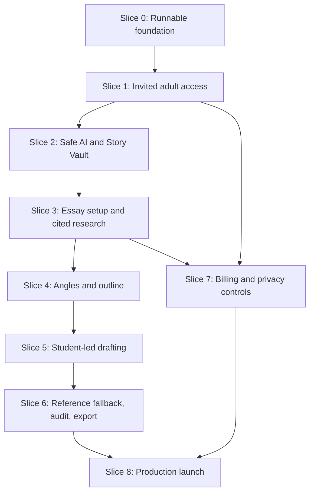

# Implementation Plan: StoryBridge Web MVP

Status: Draft for human approval  
Source of truth: `docs/specs/storybridge-mvp-spec.md`  
Planning date: 2026-08-02

## Overview

Build StoryBridge as a laptop-first, invitation-only web beta for at most 25 adult users. The plan is organized into vertical slices so each checkpoint produces a runnable user outcome. Contracts, tenant isolation, eligibility, and atomic usage reservations are deliberately early because every later AI and billing feature depends on them. No task is complete until its acceptance criteria and listed verification commands pass.

## Standing Definition of Done

Every task must:

- preserve the approved contracts and boundaries in the specification;
- include or update focused automated tests for changed behavior;
- pass its exact verification commands without weakening existing tests;
- avoid secrets, student content, or provider payloads in logs/fixtures;
- keep the app buildable and leave migrations reproducible from a clean database; and
- update the specification first if implementation requires a behavior or architecture change.

## Architecture Decisions

- Next.js 16 App Router and Route Handlers expose `/api/v1`; React Server Components remain the default.
- Canonical Zod schemas live in `contracts/http/v1`; domain types and ports remain provider-neutral.
- Services own eligibility, authorization, quota, and transactions. Adapters own Supabase, OpenAI, and Stripe shapes.
- Supabase Postgres uses RLS, composite ownership foreign keys, and column privileges. Security state is never browser-writable.
- AI returns validated dossiers, audits, or immutable proposals. AI adapters never mutate drafts, verification state, quotas, or entitlements.
- The editor persists normalized plain text and uses ETag-based optimistic concurrency.
- Chromium E2E gates the beta. Firefox and WebKit receive manual smoke checks before invitations open.

## Dependency Graph

## Slice 0: Runnable, Contract-First Foundation

### Task 1: Scaffold the pinned web runtime

**Description:** Create the minimal Next.js/TypeScript project and exact npm scripts required by Section 13, without feature code.

**Acceptance criteria:**

- [ ] Node, Next.js, React, TypeScript, ESLint, and Prettier versions are pinned and the lockfile is committed.
- [ ] `dev`, `build`, `start`, `lint`, `typecheck`, and `format:check` scripts exist and a minimal page renders.
- [ ] `.env.example` contains safe placeholders only; secret-bearing `.env*` files are ignored.

**Verification:**

- [ ] `npm install`
- [ ] `npm run lint && npm run typecheck && npm run format:check`
- [ ] `npm run build`

**Dependencies:** None  
**Files likely touched:** `package.json`, `package-lock.json`, `tsconfig.json`, `next.config.ts`, `app/page.tsx`  
**Estimated scope:** M

### Task 2: Install deterministic test harnesses

**Description:** Add Vitest, React Testing Library, Playwright Chromium, test scripts, and a single smoke test for the shell.

**Acceptance criteria:**

- [ ] `test`, `test:coverage`, and `test:e2e` scripts match the approved command contract.
- [ ] Unit/component tests run in isolation and Chromium E2E can start the production-like web server.
- [ ] Tests make no real OpenAI, Stripe, email, or hosted Supabase calls.

**Verification:**

- [ ] `npm run test`
- [ ] `npm run test:coverage`
- [ ] `npm run test:e2e -- --project=chromium`

**Dependencies:** Task 1  
**Files likely touched:** `vitest.config.ts`, `playwright.config.ts`, `tests/setup.ts`, `tests/unit/app-shell.test.tsx`, `e2e/smoke.spec.ts`  
**Estimated scope:** M

### Task 3: Implement the canonical HTTP contract package

**Description:** Define the version-1 success/error envelopes, stable error codes, branded IDs, pagination, strict parsing, and response helpers used by every route.

**Acceptance criteria:**

- [ ] Unknown request fields fail, optional response evolution remains allowed, and clients can branch on stable status/code pairs.
- [ ] Request IDs and no-store headers are produced consistently without leaking internal/provider messages.
- [ ] Branded UUIDs, RFC 3339 timestamps, cursor shape, idempotency-key, and ETag formats are validated.

**Verification:**

- [ ] `npm run test -- tests/unit/contracts/http-v1.test.ts`
- [ ] `npm run typecheck`
- [ ] `npm run build`

**Dependencies:** Tasks 1–2  
**Files likely touched:** `contracts/http/v1/envelopes.ts`, `contracts/http/v1/errors.ts`, `contracts/domain/ids.ts`, `lib/http/respond.ts`, `tests/unit/contracts/http-v1.test.ts`  
**Estimated scope:** M

### Task 4: Add validated configuration and security primitives

**Description:** Implement startup environment validation, versioned keyed HMAC helpers, origin/CSRF checks, text normalization, and body-size enforcement.

**Acceptance criteria:**

- [ ] Production startup fails for missing/equal/short HMAC keys or malformed caps, prices, URLs, and model settings.
- [ ] Separate IP, content, and idempotency HMAC purposes cannot be confused.
- [ ] Same-origin mutations, UTF-8/control-character rules, and 64 KB JSON limits return Section 11 errors.

**Verification:**

- [ ] `npm run test -- tests/unit/security/config-and-boundaries.test.ts`
- [ ] `npm run typecheck`
- [ ] `npm run build`

**Dependencies:** Task 3  
**Files likely touched:** `lib/config/server.ts`, `lib/security/hmac.ts`, `lib/security/request-boundary.ts`, `contracts/http/v1/common.ts`, `tests/unit/security/config-and-boundaries.test.ts`  
**Estimated scope:** M

### Checkpoint 0: Foundation

- [ ] `npm run lint && npm run typecheck && npm run test && npm run build`
- [ ] `npm run test:e2e -- --project=chromium`
- [ ] Review package choices and canonical contract shapes before database/API expansion.

## Slice 1: An Invited Adult Can Sign In and Enter the Product

### Task 5: Create the local Supabase ownership baseline

**Description:** Initialize Supabase, profiles, invitations, account-deletion status, helper functions, explicit grants, RLS, and the first pgTAP isolation tests.

**Acceptance criteria:**

- [ ] A clean reset creates all baseline tables, indexes, composite owner keys, and RLS policies.
- [ ] Anonymous and cross-user access fail; authenticated users cannot directly mutate invitation, eligibility, or deletion state.
- [ ] At most 25 accepted invitations can exist and policy-version fields are server-controlled.

**Verification:**

- [ ] `npx supabase start`
- [ ] `npx supabase db reset`
- [ ] `npx supabase test db`

**Dependencies:** Task 4  
**Files likely touched:** `supabase/config.toml`, `supabase/migrations/0001_identity.sql`, `supabase/tests/identity_rls.test.sql`, `adapters/supabase/database.types.ts`  
**Estimated scope:** M

### Task 6: Deliver uniform magic-link request and callback APIs

**Description:** Implement Supabase SSR adapters plus public magic-link request and callback routes with invite binding, uniform 202 responses, redirect allowlisting, and keyed rate limits.

**Acceptance criteria:**

- [ ] Existing, missing, invited, and uninvited emails receive indistinguishable request responses.
- [ ] Callback accepts only one-time valid exchanges and allowlisted relative redirects.
- [ ] Email/IP limit failures return the declared 429 envelope and rate-limit headers without storing raw IPs.

**Verification:**

- [ ] `npm run test -- tests/integration/auth/magic-link.test.ts`
- [ ] `npm run typecheck`
- [ ] `npx supabase test db`

**Dependencies:** Task 5  
**Files likely touched:** `adapters/supabase/auth.ts`, `app/api/v1/auth/magic-links/route.ts`, `app/api/v1/auth/callback/route.ts`, `services/auth/request-magic-link.ts`, `tests/integration/auth/magic-link.test.ts`  
**Estimated scope:** M

### Task 7: Enforce consent and beta eligibility

**Description:** Add the consent contract/service/route and reusable server gate that distinguishes consent bootstrap from protected product access.

**Acceptance criteria:**

- [ ] An authenticated invited user can record current policy versions without already being eligible.
- [ ] Under-18, revoked, uninvited, and stale-consent users cannot invoke coaching/product services.
- [ ] Export and deletion remain reachable to authenticated users after invitation revocation or policy rollover.

**Verification:**

- [ ] `npm run test -- tests/integration/auth/eligibility.test.ts`
- [ ] `npm run typecheck`
- [ ] `npx supabase test db`

**Dependencies:** Tasks 5–6  
**Files likely touched:** `contracts/http/v1/me.ts`, `services/auth/eligibility.ts`, `app/api/v1/me/consent/route.ts`, `repositories/profile-repository.ts`, `tests/integration/auth/eligibility.test.ts`  
**Estimated scope:** M

### Task 8: Build sign-in, consent, and authenticated shell UI

**Description:** Deliver the first vertical journey from invited email through magic-link callback, adult consent, and an empty authenticated dashboard.

**Acceptance criteria:**

- [ ] Keyboard-only users can request a link, recover from fixed auth errors, consent, and reach the dashboard.
- [ ] Protected pages redirect signed-out users; stale-consent users return to consent without redirect loops.
- [ ] The shell is responsive at 320 px and laptop widths and never exposes provider error text.

**Verification:**

- [ ] `npm run test -- tests/components/auth/access-flow.test.tsx`
- [ ] `npm run test:e2e -- --project=chromium e2e/invited-access.spec.ts`
- [ ] `npm run build`

**Dependencies:** Tasks 6–7  
**Files likely touched:** `app/(auth)/sign-in/page.tsx`, `app/(auth)/consent/page.tsx`, `app/(product)/layout.tsx`, `components/auth/access-form.tsx`, `e2e/invited-access.spec.ts`  
**Estimated scope:** M

### Checkpoint 1: Invited access

- [ ] Clean DB reset, pgTAP, unit, integration, and build checks pass.
- [ ] E2E proves invited adult access and direct-API denial for ineligible users.
- [ ] Human verifies sign-in email wording, policy copy, and the 18+ beta restriction.

## Slice 2: A Student Completes One Interview and Owns a Safe Story Vault

### Task 9: Establish the provider-neutral AI adapter boundary

**Description:** Add the OpenAI Responses adapter, moderation adapter, strict structured-output parsing, keyed safety identifier, deadlines, retries, and synthetic fixtures.

**Acceptance criteria:**

- [ ] Domain/services depend on ports, never OpenAI SDK types; invalid/refused/provider responses map to typed errors.
- [ ] Every request sets `store:false`, purpose-specific token limits, keyed safety ID, and an explicit deadline.
- [ ] Recorded synthetic fixtures cover success, schema failure, refusal, moderation signal, and timeout without student content.

**Verification:**

- [ ] `npm run test -- tests/integration/ai/openai-adapter.test.ts`
- [ ] `npm run typecheck`
- [ ] `npm run build`

**Dependencies:** Tasks 3–4, 7  
**Files likely touched:** `contracts/domain/ai-ports.ts`, `adapters/openai/client.ts`, `adapters/openai/structured-response.ts`, `adapters/openai/moderation.ts`, `tests/integration/ai/openai-adapter.test.ts`  
**Estimated scope:** M

### Task 10: Reserve AI usage atomically before provider calls

**Description:** Add AI operation/idempotency records, usage reservations, keyed IP windows, daily quota, account cap, and global monthly budget transaction.

**Acceptance criteria:**

- [ ] Concurrent requests cannot exceed per-user, fallback, account, or monthly budget limits.
- [ ] Same-key/same-body replay returns the original resource; changed-body reuse returns 409.
- [ ] Pre-provider failures release reservations; started/refused/timeout/unknown calls consume quota without logging content.

**Verification:**

- [ ] `npx supabase db reset && npx supabase test db`
- [ ] `npm run test -- tests/integration/ai/usage-reservations.test.ts`
- [ ] `npm run typecheck`

**Dependencies:** Tasks 5, 9  
**Files likely touched:** `supabase/migrations/0002_ai_operations.sql`, `supabase/tests/ai_operations.test.sql`, `services/ai/reserve-operation.ts`, `repositories/ai-operation-repository.ts`, `tests/integration/ai/usage-reservations.test.ts`  
**Estimated scope:** M

### Task 11: Persist and serve resumable interview turns

**Description:** Implement interview tables, fixed question catalog, current-session/start/message routes, moderation, sequencing, and resume behavior.

**Acceptance criteria:**

- [ ] A user has at most one active session and answers are ordered and resumable after reload.
- [ ] Question keys are server-owned; unknown/replayed/out-of-order answers fail safely.
- [ ] Cross-user session IDs return the same 404 as missing IDs and direct table writes are denied.

**Verification:**

- [ ] `npx supabase db reset && npx supabase test db`
- [ ] `npm run test -- tests/integration/interview/session-api.test.ts`
- [ ] `npm run typecheck`

**Dependencies:** Tasks 7, 10  
**Files likely touched:** `supabase/migrations/0003_interviews.sql`, `contracts/http/v1/interviews.ts`, `services/interview/interview-service.ts`, `app/api/v1/interview-sessions/route.ts`, `tests/integration/interview/session-api.test.ts`  
**Estimated scope:** M

### Task 12: Build the resumable interview UI

**Description:** Present the 8–10 fixed questions, at most two targeted follow-ups, autosaved answers, coverage progress, and safe moderation recovery.

**Acceptance criteria:**

- [ ] Keyboard and screen-reader users can answer, pause, reload, and resume at the correct question.
- [ ] UI never marks an answer saved until the server confirms its sequence.
- [ ] Moderation/safety responses preserve prior answers and do not continue essay generation in that turn.

**Verification:**

- [ ] `npm run test -- tests/components/interview/interview-flow.test.tsx`
- [ ] `npm run test:e2e -- --project=chromium e2e/interview.spec.ts`
- [ ] `npm run build`

**Dependencies:** Task 11  
**Files likely touched:** `app/(product)/interview/page.tsx`, `components/interview/interview-flow.tsx`, `components/interview/question-card.tsx`, `tests/components/interview/interview-flow.test.tsx`, `e2e/interview.spec.ts`  
**Estimated scope:** M

### Task 13: Extract a source-linked unverified Story Vault

**Description:** Implement interview completion, structured extraction, story profiles/facts/source joins, and atomic idempotent persistence.

**Acceptance criteria:**

- [ ] Completion creates a versioned Story Vault whose facts reference owned source-message rows and begin unverified.
- [ ] Uncertain/sensitive inferences are not asserted as facts; insufficient coverage returns a targeted recoverable error.
- [ ] Idempotent replay cannot create duplicate profiles/facts or consume a second AI operation.

**Verification:**

- [ ] `npx supabase db reset && npx supabase test db`
- [ ] `npm run test -- tests/integration/story-vault/extraction.test.ts`
- [ ] `npm run typecheck`

**Dependencies:** Tasks 10–12  
**Files likely touched:** `supabase/migrations/0004_story_vault.sql`, `contracts/domain/story-vault.ts`, `services/story-vault/extract-profile.ts`, `app/api/v1/interview-sessions/[sessionId]/complete/route.ts`, `tests/integration/story-vault/extraction.test.ts`  
**Estimated scope:** M

### Task 14: Deliver Story Vault review and privacy controls

**Description:** Implement profile/fact routes and UI for editing, ETag-safe verification, deletion, fact-level suppression, excluded topics, and source visibility.

**Acceptance criteria:**

- [ ] Editing atomically un-verifies a fact; stale verification cannot verify unseen content.
- [ ] Suppressed/deleted facts are absent from every AI-context repository result.
- [ ] The user can review sources, edit, verify/reject, suppress/restore, and delete using accessible controls.

**Verification:**

- [ ] `npm run test -- tests/integration/story-vault/fact-lifecycle.test.ts tests/components/story-vault/review.test.tsx`
- [ ] `npx supabase test db`
- [ ] `npm run test:e2e -- --project=chromium e2e/story-vault.spec.ts`

**Dependencies:** Task 13  
**Files likely touched:** `services/story-vault/manage-facts.ts`, `app/api/v1/story-facts/[factId]/route.ts`, `app/(product)/story-vault/page.tsx`, `components/story-vault/fact-card.tsx`, `tests/integration/story-vault/fact-lifecycle.test.ts`  
**Estimated scope:** M

### Checkpoint 2: Reusable Story Vault

- [ ] E2E: invited user completes interview, reviews sources, edits, verifies, suppresses, and reloads the vault.
- [ ] Concurrency test proves stale fact verification fails with 412.
- [ ] Captured AI adapter payload proves suppressed facts never leave the repository boundary.

## Slice 3: A Student Creates an Essay and Receives Cited School Research

### Task 15: Provide the verified school registry

**Description:** Add private school registry and user request tables, seed at least 10 operator-verified institutions, and expose search/request endpoints.

**Acceptance criteria:**

- [ ] Each active school has canonical domain, verification source/verifier/timestamp, and a unique normalized domain.
- [ ] Users can search active schools and request unsupported schools but cannot change registry data.
- [ ] Invalid cursors, arbitrary domains, and cross-user request access fail under contract.

**Verification:**

- [ ] `npx supabase db reset && npx supabase test db`
- [ ] `npm run test -- tests/integration/schools/registry.test.ts`
- [ ] `npm run typecheck`

**Dependencies:** Tasks 5, 7  
**Files likely touched:** `supabase/migrations/0005_school_registry.sql`, `supabase/seed.sql`, `app/api/v1/schools/route.ts`, `app/api/v1/school-requests/route.ts`, `tests/integration/schools/registry.test.ts`  
**Estimated scope:** M

### Task 16: Create entitlement-aware essay workspaces

**Description:** Add free entitlement, essays, allowance transaction, list/create/get/delete routes, prompt privacy classifier, and pagination.

**Acceptance criteria:**

- [ ] An eligible user can atomically create one free workspace; concurrent creation cannot exceed allowance and deletion does not restore it.
- [ ] Only registry schools are accepted, prompts remain private, and suspected personal notes/essays return `PROMPT_PRIVACY_RISK`.
- [ ] List/get/delete are owner-scoped and stable cursor pagination works.

**Verification:**

- [ ] `npx supabase db reset && npx supabase test db`
- [ ] `npm run test -- tests/integration/essays/workspace-api.test.ts`
- [ ] `npm run typecheck`

**Dependencies:** Tasks 10, 14–15  
**Files likely touched:** `supabase/migrations/0006_essays_entitlements.sql`, `contracts/http/v1/essays.ts`, `services/essays/manage-workspaces.ts`, `app/api/v1/essays/route.ts`, `tests/integration/essays/workspace-api.test.ts`  
**Estimated scope:** M

### Task 17: Build essay dashboard and setup UI

**Description:** Deliver essay listing, registry search, unsupported-school request, prompt/word-limit validation, privacy warnings, and free-limit recovery.

**Acceptance criteria:**

- [ ] A user can create and reopen an essay without typing or confirming a domain.
- [ ] Prompt privacy/validation errors preserve safe form state and identify exact recovery actions.
- [ ] Empty, loading, limit, and unsupported-school states are keyboard accessible and responsive.

**Verification:**

- [ ] `npm run test -- tests/components/essays/setup.test.tsx`
- [ ] `npm run test:e2e -- --project=chromium e2e/essay-setup.spec.ts`
- [ ] `npm run build`

**Dependencies:** Task 16  
**Files likely touched:** `app/(product)/essays/page.tsx`, `app/(product)/essays/new/page.tsx`, `components/essay/school-picker.tsx`, `components/essay/essay-setup-form.tsx`, `e2e/essay-setup.spec.ts`  
**Estimated scope:** M

### Task 18: Implement privacy-separated school research adapter

**Description:** Build the server-owned research rubric, domain-constrained web-search request, strict dossier schema, redirect/domain validation, excerpt support, and prompt-injection defenses.

**Acceptance criteria:**

- [ ] Captured search payload contains only canonical school name, registry domain, and server rubric—never prompt/profile/draft/user data.
- [ ] Off-domain redirects, unsupported claims, missing excerpts/citations, and schema-invalid responses are rejected.
- [ ] Downstream dossier data is explicitly delimited as untrusted quoted content.

**Verification:**

- [ ] `npm run test -- tests/integration/research/research-adapter.test.ts`
- [ ] `npm run test -- tests/security/research-payload-privacy.test.ts`
- [ ] `npm run typecheck`

**Dependencies:** Tasks 9–10, 15  
**Files likely touched:** `contracts/domain/school-dossier.ts`, `adapters/openai/school-research.ts`, `lib/security/domain-validation.ts`, `tests/integration/research/research-adapter.test.ts`, `tests/security/research-payload-privacy.test.ts`  
**Estimated scope:** M

### Task 19: Persist and display a cited school dossier

**Description:** Add dossier/source storage, initial research route, idempotent operation linkage, and a research panel with visible citation/excerpt provenance.

**Acceptance criteria:**

- [ ] Initial research binds one ready dossier to the owned essay only after a fully valid provider result.
- [ ] Every displayed claim includes category, short supporting excerpt, retrieval time, and clickable on-domain citation.
- [ ] Failure/timeout leaves the essay and prior student work unchanged and gives a typed retry action.

**Verification:**

- [ ] `npx supabase db reset && npx supabase test db`
- [ ] `npm run test -- tests/integration/research/dossier-api.test.ts tests/components/research/dossier-panel.test.tsx`
- [ ] `npm run test:e2e -- --project=chromium e2e/research.spec.ts`

**Dependencies:** Tasks 16–18  
**Files likely touched:** `supabase/migrations/0007_school_dossiers.sql`, `services/research/create-dossier.ts`, `app/api/v1/essays/[essayId]/research/route.ts`, `components/essay/research-panel.tsx`, `tests/integration/research/dossier-api.test.ts`  
**Estimated scope:** M

### Task 20: Make dossier refresh invalidate dependents atomically

**Description:** Implement the explicit refresh confirmation, If-Match precondition, new dossier binding, dependent-work invalidation, and conflict recovery.

**Acceptance criteria:**

- [ ] Refresh cannot run without `invalidateDependentWork:true`, idempotency, and a current essay ETag.
- [ ] Commit atomically rebinds dossier, clears angles/selection/outline, expires pending proposals, and increments revision.
- [ ] A concurrent essay change returns 412 and retains the original dossier/dependent work.

**Verification:**

- [ ] `npm run test -- tests/integration/research/refresh-invalidation.test.ts`
- [ ] `npx supabase test db`
- [ ] `npm run typecheck`

**Dependencies:** Task 19  
**Files likely touched:** `services/research/refresh-dossier.ts`, `repositories/essay-repository.ts`, `components/essay/refresh-research-dialog.tsx`, `tests/integration/research/refresh-invalidation.test.ts`  
**Estimated scope:** S

### Checkpoint 3: Essay setup and research

- [ ] E2E: create essay from registry, run research, inspect every citation, reload, and safely refresh.
- [ ] Privacy test proves prompt and private fields never enter web-search payloads.
- [ ] Human verifies all 10 seeded registry records and their official-domain evidence.

## Slice 4: A Student Selects a Personalized Angle and Builds an Outline

### Task 21: Generate evidence-linked essay angles

**Description:** Add angle/evidence tables and a private no-search service that matches verified non-suppressed facts to the current cited dossier and returns exactly three distinct proposals.

**Acceptance criteria:**

- [ ] Each angle references owned verified facts and current-dossier sources through composite join tables.
- [ ] Insufficient evidence returns one targeted follow-up instead of invented facts; one regeneration is atomically enforced.
- [ ] Dossier text remains untrusted and web search is unavailable in the matching call.

**Verification:**

- [ ] `npx supabase db reset && npx supabase test db`
- [ ] `npm run test -- tests/integration/strategy/angles.test.ts`
- [ ] `npm run test -- tests/evals/angles.eval.test.ts`

**Dependencies:** Tasks 14, 19–20  
**Files likely touched:** `supabase/migrations/0008_angles.sql`, `services/strategy/generate-angles.ts`, `adapters/openai/angle-generator.ts`, `app/api/v1/essays/[essayId]/angles/route.ts`, `tests/integration/strategy/angles.test.ts`  
**Estimated scope:** M

### Task 22: Deliver angle comparison and selection UI

**Description:** Show three materially different strategies with evidence/citations, risks, prompt fit, regeneration, edits, and atomic selection.

**Acceptance criteria:**

- [ ] A user can compare evidence, open citations, edit an angle, and select exactly one owned angle.
- [ ] Selection rejects an angle from another essay/user and survives reload.
- [ ] Insufficient-evidence and used-regeneration states provide clear recovery paths.

**Verification:**

- [ ] `npm run test -- tests/components/strategy/angle-picker.test.tsx`
- [ ] `npm run test:e2e -- --project=chromium e2e/angles.spec.ts`
- [ ] `npm run build`

**Dependencies:** Task 21  
**Files likely touched:** `components/essay/angle-card.tsx`, `components/essay/angle-picker.tsx`, `app/api/v1/essays/[essayId]/angles/[angleId]/selection/route.ts`, `tests/components/strategy/angle-picker.test.tsx`, `e2e/angles.spec.ts`  
**Estimated scope:** M

### Task 23: Generate immutable outline proposals

**Description:** Add OUTLINE proposal persistence and generation with 3–6 sections, evidence links, and word allocations within 10% of the limit.

**Acceptance criteria:**

- [ ] Generation creates an immutable, non-directly-accepting proposal tied to the current essay revision/angle.
- [ ] Every section uses owned current evidence and total target words satisfy the approved constraint.
- [ ] Same-key replay returns the same proposal without a second provider call.

**Verification:**

- [ ] `npm run test -- tests/integration/strategy/outline-proposal.test.ts`
- [ ] `npm run test -- tests/evals/outline.eval.test.ts`
- [ ] `npm run typecheck`

**Dependencies:** Tasks 10, 22  
**Files likely touched:** `contracts/http/v1/outlines.ts`, `services/strategy/propose-outline.ts`, `adapters/openai/outline-generator.ts`, `app/api/v1/essays/[essayId]/outline-proposals/route.ts`, `tests/integration/strategy/outline-proposal.test.ts`  
**Estimated scope:** M

### Task 24: Build ETag-safe outline editing

**Description:** Let users copy an outline proposal into an editable outline, reorder/edit/add/remove sections, and persist through the canonical essay patch.

**Acceptance criteria:**

- [ ] Proposal text never mutates the outline until the user explicitly starts from it.
- [ ] Invalid evidence, word allocation, empty sections, and stale ETags fail without losing local edits.
- [ ] A valid outline persists, reloads, and unlocks drafting/fallback prerequisites.

**Verification:**

- [ ] `npm run test -- tests/components/strategy/outline-editor.test.tsx tests/integration/essays/outline-patch.test.ts`
- [ ] `npm run test:e2e -- --project=chromium e2e/outline.spec.ts`
- [ ] `npm run build`

**Dependencies:** Task 23  
**Files likely touched:** `components/essay/outline-editor.tsx`, `app/api/v1/essays/[essayId]/route.ts`, `services/essays/patch-essay.ts`, `tests/components/strategy/outline-editor.test.tsx`, `e2e/outline.spec.ts`  
**Estimated scope:** M

### Checkpoint 4: Strategy and outline

- [ ] E2E: research → three angles → selected angle → editable evidence-linked outline.
- [ ] Evaluation fixtures contain no unsupported angle/outline evidence.
- [ ] Refreshing research demonstrably invalidates the prior strategy without partial state.

## Slice 5: A Student Writes and Accepts Only Explicit AI Suggestions

### Task 25: Persist conflict-safe drafts and versions

**Description:** Add normalized draft persistence, revisions, ETags, version snapshots, status transitions, and patch conflict semantics.

**Acceptance criteria:**

- [ ] Current ETag updates plain text and increments revision; missing/stale preconditions return 428/412 with no mutation.
- [ ] Concurrent saves never replace a newer draft and accepted-proposal snapshots are distinguishable from autosaves.
- [ ] Draft length, control characters, status transitions, and ownership are enforced server-side.

**Verification:**

- [ ] `npx supabase db reset && npx supabase test db`
- [ ] `npm run test -- tests/integration/editor/draft-concurrency.test.ts`
- [ ] `npm run typecheck`

**Dependencies:** Tasks 16, 24  
**Files likely touched:** `supabase/migrations/0009_essay_versions.sql`, `services/essays/save-draft.ts`, `repositories/essay-version-repository.ts`, `app/api/v1/essays/[essayId]/route.ts`, `tests/integration/editor/draft-concurrency.test.ts`  
**Estimated scope:** M

### Task 26: Build the autosaving plain-text editor

**Description:** Deliver local typing/word count, 750 ms autosave, blur flush, local recovery buffer, visible save states, and conflict recovery.

**Acceptance criteria:**

- [ ] Typing remains below the specified local latency and successful saves visibly transition Saving → Saved.
- [ ] Blur does not create a second concurrent save; network failure preserves newer local text.
- [ ] A 412 displays a conflict choice without silently overwriting local or server content.

**Verification:**

- [ ] `npm run test -- tests/components/editor/autosave-editor.test.tsx`
- [ ] `npm run test:e2e -- --project=chromium e2e/editor-autosave.spec.ts`
- [ ] `npm run build`

**Dependencies:** Task 25  
**Files likely touched:** `app/(product)/essays/[essayId]/page.tsx`, `components/essay/plain-text-editor.tsx`, `components/essay/use-autosave.ts`, `tests/components/editor/autosave-editor.test.tsx`, `e2e/editor-autosave.spec.ts`  
**Estimated scope:** M

### Task 27: Deliver advice-only coaching

**Description:** Generate immutable ADVICE proposals from minimum verified context, moderate user question/draft input, and display advice without any insertion path.

**Acceptance criteria:**

- [ ] Advice is tied to current essay revision and cannot be accepted or mutate the draft.
- [ ] Input moderation, evidence bounds, token caps, quota, and idempotent replay are enforced.
- [ ] Coach UI preserves the draft on refusal, timeout, quota, and provider errors.

**Verification:**

- [ ] `npm run test -- tests/integration/coaching/advice.test.ts tests/components/coaching/coach-panel.test.tsx`
- [ ] `npm run test -- tests/evals/coaching.eval.test.ts`
- [ ] `npm run typecheck`

**Dependencies:** Tasks 14, 19, 26  
**Files likely touched:** `services/coaching/propose-advice.ts`, `adapters/openai/coach.ts`, `app/api/v1/essays/[essayId]/coach-proposals/route.ts`, `components/essay/coach-panel.tsx`, `tests/integration/coaching/advice.test.ts`  
**Estimated scope:** M

### Task 28: Generate rewrite and continuation proposals

**Description:** Implement selection/context hashes, typed rewrite instructions, one-to-three bounded continuations, evidence manifests, expiry, and immutable proposal persistence.

**Acceptance criteria:**

- [ ] Rewrites/continuations target the exact revision and selection/context hash submitted.
- [ ] Output stays within length/voice/evidence constraints and unsupported generated claims are marked blocking.
- [ ] Custom instructions are accepted only for CUSTOM and every user-authored field is moderated.

**Verification:**

- [ ] `npm run test -- tests/integration/coaching/rewrite-continuation.test.ts`
- [ ] `npm run test -- tests/evals/rewrite-continuation.eval.test.ts`
- [ ] `npm run typecheck`

**Dependencies:** Tasks 10, 25–27  
**Files likely touched:** `contracts/http/v1/proposals.ts`, `services/coaching/propose-rewrite.ts`, `services/coaching/propose-continuation.ts`, `adapters/openai/revision.ts`, `tests/integration/coaching/rewrite-continuation.test.ts`  
**Estimated scope:** M

### Task 29: Preview and atomically accept eligible proposals

**Description:** Add the accept command plus diff UI that alone can apply REWRITE/CONTINUATION proposals after validating ownership, revision, hashes, evidence, status, and expiry.

**Acceptance criteria:**

- [ ] Only rewrite/continuation kinds are accept-capable; advice/outline/reference attempts return a stable conflict.
- [ ] Acceptance transaction creates one version, updates draft/revision, marks proposal accepted, and replays idempotently.
- [ ] Stale/wrong-owner/wrong-essay/changed-selection/expired proposals mutate nothing and preserve local text.

**Verification:**

- [ ] `npm run test -- tests/integration/coaching/proposal-acceptance.test.ts tests/components/coaching/proposal-diff.test.tsx`
- [ ] `npx supabase test db`
- [ ] `npm run test:e2e -- --project=chromium e2e/rewrite-acceptance.spec.ts`

**Dependencies:** Task 28  
**Files likely touched:** `services/coaching/accept-proposal.ts`, `app/api/v1/essays/[essayId]/proposals/[proposalId]/accept/route.ts`, `components/essay/proposal-diff.tsx`, `tests/integration/coaching/proposal-acceptance.test.ts`, `e2e/rewrite-acceptance.spec.ts`  
**Estimated scope:** M

### Checkpoint 5: Student-led drafting

- [ ] E2E: type → autosave → ask coach → preview rewrite → explicit accept → reload exact new revision.
- [ ] Adversarial tests prove no AI route can directly mutate draft state.
- [ ] Network/conflict tests prove student text survives every error path.

## Slice 6: A Stuck Student Uses the Fallback Without Exporting It as Their Draft

### Task 30: Generate one read-only reference draft

**Description:** Enforce fallback prerequisites, acknowledgment, atomic one-per-essay provider-start slot, verified evidence-only generation, and persisted claim manifest.

**Acceptance criteria:**

- [ ] Missing vault/angle/outline/acknowledgment blocks generation before quota/provider use.
- [ ] Concurrent calls start at most one provider operation; pre-start failure can retry but any started/unknown attempt consumes the fallback.
- [ ] Every factual sentence maps to owned verified non-suppressed facts or current dossier sources; reference kind is never accept-capable.

**Verification:**

- [ ] `npx supabase test db`
- [ ] `npm run test -- tests/integration/fallback/reference-draft.test.ts`
- [ ] `npm run test -- tests/evals/reference-draft.eval.test.ts`

**Dependencies:** Tasks 24, 28–29  
**Files likely touched:** `supabase/migrations/0010_proposal_claims.sql`, `services/fallback/generate-reference.ts`, `adapters/openai/reference-draft.ts`, `app/api/v1/essays/[essayId]/reference-draft/route.ts`, `tests/integration/fallback/reference-draft.test.ts`  
**Estimated scope:** M

### Task 31: Present reference claims and record immutable decisions

**Description:** Build the separately labeled read-only panel and claim confirmation/rejection command bound to immutable claim-content HMACs.

**Acceptance criteria:**

- [ ] The app exposes no insert, accept, application-copy, or reference-export action.
- [ ] Each claim shows its fact/source evidence and an owned user can confirm/reject it exactly once per immutable content version.
- [ ] Claim decisions survive ordinary draft revisions; rejected claims remain visible as export blockers until absent.

**Verification:**

- [ ] `npm run test -- tests/integration/fallback/claim-decisions.test.ts tests/components/fallback/reference-panel.test.tsx`
- [ ] `npm run test:e2e -- --project=chromium e2e/reference-draft.spec.ts`
- [ ] `npm run build`

**Dependencies:** Task 30  
**Files likely touched:** `services/fallback/decide-claim.ts`, `app/api/v1/essays/[essayId]/reference-claim-confirmations/[claimId]/route.ts`, `components/essay/reference-draft-panel.tsx`, `tests/integration/fallback/claim-decisions.test.ts`, `e2e/reference-draft.spec.ts`  
**Estimated scope:** M

### Task 32: Persist current-revision audits and deterministic similarity

**Description:** Implement local similarity metrics, typed audit persistence, word/prompt/evidence/citation/voice checks, rejected-claim absence, and PASS/BLOCKED status.

**Acceptance criteria:**

- [ ] NFKC/token/four-gram/contiguous-match rules match the exact thresholds and boundary fixtures in the spec.
- [ ] Audit is bound to one essay revision; any edit makes it non-current and export-ineligible.
- [ ] Unsupported facts, rejected claims still present, word limit, and substantial similarity are blocking typed issues.

**Verification:**

- [ ] `npm run test -- tests/unit/audit/similarity.test.ts tests/integration/audit/essay-audit.test.ts`
- [ ] `npm run test -- tests/evals/audit.eval.test.ts`
- [ ] `npm run typecheck`

**Dependencies:** Tasks 25, 30–31  
**Files likely touched:** `domain/audit/similarity.ts`, `services/audit/audit-essay.ts`, `app/api/v1/essays/[essayId]/audits/route.ts`, `tests/unit/audit/similarity.test.ts`, `tests/integration/audit/essay-audit.test.ts`  
**Estimated scope:** M

### Task 33: Deliver final review and student-draft-only export

**Description:** Show typed audit issues and implement clipboard/`.txt` export that returns only the editable draft after every current gate passes.

**Acceptance criteria:**

- [ ] Export requires a current PASS audit and valid claim decisions; stale/blocked states return declared JSON errors.
- [ ] Successful download is normalized `text/plain`, no-store, and contains no reference draft, metadata, AI label, or other-user content.
- [ ] Final review links each issue to a recovery action and reminds users to follow institutional AI policy.

**Verification:**

- [ ] `npm run test -- tests/integration/export/plain-text-export.test.ts tests/components/audit/final-review.test.tsx`
- [ ] `npm run test:e2e -- --project=chromium e2e/final-export.spec.ts`
- [ ] `npm run build`

**Dependencies:** Task 32  
**Files likely touched:** `services/export/export-draft.ts`, `app/api/v1/essays/[essayId]/export.txt/route.ts`, `components/essay/final-review.tsx`, `tests/integration/export/plain-text-export.test.ts`, `e2e/final-export.spec.ts`  
**Estimated scope:** M

### Checkpoint 6: Integrity-safe completion

- [ ] E2E: reference fallback → claim decisions → meaningful rewrite → PASS audit → student-draft-only export.
- [ ] Similarity boundary and unsupported-claim fixtures block export deterministically.
- [ ] No endpoint or UI action returns the reference draft as exportable/acceptable essay content.

## Slice 7: A Student Can Pay, Export Their Data, or Leave Safely

### Task 34: Create idempotent Stripe Checkout sessions

**Description:** Add Stripe adapter, checkout/binding records, session creation route, price/season binding, expiry replacement, and billing UI.

**Acceptance criteria:**

- [ ] Server creates one unexpired open session per user/season and atomically expires elapsed sessions before replacement.
- [ ] Checkout and PaymentIntent metadata carry the internal random binding/season; client inputs cannot set price, amount, currency, user, or mode.
- [ ] Same idempotency key returns the original Stripe-hosted URL without duplicate sessions.

**Verification:**

- [ ] `npx supabase db reset && npx supabase test db`
- [ ] `npm run test -- tests/integration/billing/checkout-session.test.ts`
- [ ] `npm run typecheck`

**Dependencies:** Tasks 10, 16  
**Files likely touched:** `supabase/migrations/0011_billing.sql`, `adapters/stripe/checkout.ts`, `services/billing/create-checkout.ts`, `app/api/v1/billing/checkout-sessions/route.ts`, `tests/integration/billing/checkout-session.test.ts`  
**Estimated scope:** M

### Task 35: Fulfill and reverse entitlements from verified webhooks

**Description:** Implement raw-body signature verification, strict event adapters, event ledger, expiry, binding correlation, reversal tombstones, monotonic state transitions, and retry behavior.

**Acceptance criteria:**

- [ ] Completion grants only after exact live/mode/payment/price/amount/currency/season/user binding checks.
- [ ] Replays and out-of-order expiry/refund/dispute/completion cannot double-grant or reactivate terminal access.
- [ ] Retry-pending correlation returns 500 and resumes the same event; unrelated/permanent mismatches return safe terminal responses and alerts.

**Verification:**

- [ ] `npx supabase test db`
- [ ] `npm run test -- tests/integration/billing/stripe-webhook.test.ts`
- [ ] `npm run test:e2e -- --project=chromium e2e/billing-entitlement.spec.ts`

**Dependencies:** Task 34  
**Files likely touched:** `adapters/stripe/webhook.ts`, `services/billing/process-webhook.ts`, `app/api/v1/billing/stripe-webhook/route.ts`, `supabase/tests/billing_concurrency.test.sql`, `tests/integration/billing/stripe-webhook.test.ts`  
**Estimated scope:** M

### Task 36: Apply paid allowance without bypassing atomic limits

**Description:** Connect ACTIVE season-pass entitlements to essay creation while preserving free/paid allowance transactions, terminal reversals, and existing workspaces.

**Acceptance criteria:**

- [ ] ACTIVE paid users can create up to 20 seasonal workspaces; concurrent creation cannot exceed the limit.
- [ ] REFUNDED/REVOKED users cannot create new paid workspaces and late completion does not restore access.
- [ ] Existing content remains exportable/deletable after entitlement loss, subject to integrity gates.

**Verification:**

- [ ] `npm run test -- tests/integration/billing/paid-allowance.test.ts`
- [ ] `npx supabase test db`
- [ ] `npm run typecheck`

**Dependencies:** Tasks 16, 35  
**Files likely touched:** `services/essays/essay-allowance.ts`, `repositories/entitlement-repository.ts`, `app/api/v1/billing/entitlement/route.ts`, `tests/integration/billing/paid-allowance.test.ts`  
**Estimated scope:** S

### Task 37: Deliver account data export and deletion

**Description:** Implement bounded JSON export, deletion queue/worker, immediate session revocation, one-time deletion status token, provider cleanup ordering, and settings UI.

**Acceptance criteria:**

- [ ] Authenticated users can export/delete after invite revocation, policy rollover, or entitlement loss.
- [ ] Export includes only caller application data and excludes fraud/rate-limit secrets and other users.
- [ ] Deletion cascades live content, clears raw user ID after completion, preserves only permitted payment records, and exposes token-scoped status for 30 days.

**Verification:**

- [ ] `npx supabase test db`
- [ ] `npm run test -- tests/integration/privacy/account-lifecycle.test.ts`
- [ ] `npm run test:e2e -- --project=chromium e2e/account-privacy.spec.ts`

**Dependencies:** Tasks 7, 14, 16, 35  
**Files likely touched:** `services/privacy/export-account.ts`, `services/privacy/delete-account.ts`, `app/api/v1/me/route.ts`, `app/(product)/settings/page.tsx`, `tests/integration/privacy/account-lifecycle.test.ts`  
**Estimated scope:** M

### Checkpoint 7: Commerce and privacy

- [ ] Stripe test-mode E2E proves checkout → webhook → paid allowance → refund/revocation.
- [ ] Replay/out-of-order webhook concurrency suite passes.
- [ ] Data export and deletion complete without support intervention or eligibility lockout.

## Slice 8: The Closed Beta Can Open Safely

### Task 38: Add content-free analytics and operational visibility

**Description:** Implement the allowlisted product events, content-free AI cost/latency records, request-ID error logging, budget alerts, and synthetic monitoring hook.

**Acceptance criteria:**

- [ ] Unknown event/property names fail validation and free text/source query strings cannot enter analytics.
- [ ] AI/provider metrics contain purpose/model/tokens/cost/latency/status only; request IDs correlate safe errors.
- [ ] Budget/account-cap/webhook retry conditions produce content-free operator alerts.

**Verification:**

- [ ] `npm run test -- tests/unit/analytics/allowlist.test.ts tests/integration/observability/safe-logging.test.ts`
- [ ] `npm run typecheck`
- [ ] `npm run build`

**Dependencies:** Tasks 10, 35  
**Files likely touched:** `contracts/domain/analytics.ts`, `lib/analytics/track.ts`, `lib/observability/logger.ts`, `services/observability/alerts.ts`, `tests/unit/analytics/allowlist.test.ts`  
**Estimated scope:** M

### Task 39: Publish accurate marketing, policy, and support surfaces

**Description:** Build the public landing/pricing pages and the Privacy, Terms, Responsible Use, support, and deletion explanations from implemented behavior.

**Acceptance criteria:**

- [ ] Product copy promises coaching deliverables, not admission outcomes, and accurately states the adult closed-beta boundary.
- [ ] Pricing, AI/reference-draft limitations, data processors/retention, deletion, and support paths match implementation.
- [ ] Public pages contain no fabricated testimonials or unsupported security/compliance claims.

**Verification:**

- [ ] `npm run test -- tests/components/marketing/policy-pages.test.tsx`
- [ ] `npm run test:e2e -- --project=chromium e2e/public-pages.spec.ts`
- [ ] `npm run build`

**Dependencies:** Tasks 8, 30–38  
**Files likely touched:** `app/(marketing)/page.tsx`, `app/(marketing)/pricing/page.tsx`, `app/(marketing)/policies/page.tsx`, `tests/components/marketing/policy-pages.test.tsx`, `e2e/public-pages.spec.ts`  
**Estimated scope:** M

### Task 40: Complete responsive accessibility audit

**Description:** Audit and fix the implemented product journey for keyboard/focus/error semantics, ARIA status regions, contrast, reduced motion, and laptop/mobile layout.

**Acceptance criteria:**

- [ ] Core journey is keyboard-complete with visible focus, labeled errors, appropriate live regions, and WCAG 2.2 AA contrast.
- [ ] No horizontal scroll occurs at 320 px; the 1280–1440 px editor uses accessible collapsible panels.
- [ ] Automated Chromium accessibility checks pass and the manual screen-reader/Firefox/WebKit checklist is ready for release execution.

**Verification:**

- [ ] `npm run test -- tests/components/accessibility/core-journey.test.tsx`
- [ ] `npm run test:e2e -- --project=chromium e2e/accessibility.spec.ts`
- [ ] `npm run build`

**Dependencies:** Tasks 8, 12, 14, 17, 19, 22, 24, 26, 29, 31, 33, 37, 39  
**Files likely touched:** `components/ui/async-status.tsx`, `components/ui/error-summary.tsx`, `styles/globals.css`, `tests/components/accessibility/core-journey.test.tsx`, `e2e/accessibility.spec.ts`  
**Estimated scope:** M

### Task 41: Automate CI and preview deployment gates

**Description:** Add CI for lint/typecheck/format/unit/integration/build/pgTAP/Chromium E2E and document isolated preview/production configuration.

**Acceptance criteria:**

- [ ] Pull requests cannot pass with a failing required gate and no job uses production student data/secrets.
- [ ] Preview uses isolated Supabase staging, Stripe test mode, mocked/recorded AI by default, and safe environment validation.
- [ ] Migrations run from clean state and artifacts expose no secrets or essay content.

**Verification:**

- [ ] `npm run lint && npm run typecheck && npm run format:check`
- [ ] `npm run test:coverage && npm run build`
- [ ] `npx supabase db reset && npx supabase test db && npm run test:e2e -- --project=chromium`

**Dependencies:** Tasks 1–40  
**Files likely touched:** `.github/workflows/ci.yml`, `docs/deployment.md`, `.env.example`, `playwright.config.ts`  
**Estimated scope:** M

### Task 42: Execute the production release gate

**Description:** Configure production services, apply reviewed migrations, seed/verify registry data, run synthetic journeys, test live payment/refund behavior, and open invitations only after every gate passes.

**Acceptance criteria:**

- [ ] Production enforces 25 accounts, USD $150 monthly AI ceiling, provider billing alerts, and 10 verified schools.
- [ ] Synthetic full journey, live low-value purchase/refund reversal, deletion, security, and content-free monitoring checks pass.
- [ ] Manual Firefox/WebKit smoke, keyboard/screen-reader smoke, secret scan, and owner release checklist are signed off before invitations open.

**Verification:**

- [ ] `npm run lint && npm run typecheck && npm run format:check && npm run test:coverage && npm run build`
- [ ] `npx supabase test db && npm run test:e2e -- --project=chromium`
- [ ] `curl -fsS "$NEXT_PUBLIC_APP_URL/"`

**Dependencies:** Tasks 38–41  
**Files likely touched:** `docs/release-checklist.md`, `docs/runbooks/budget-cap.md`, `docs/runbooks/webhook-recovery.md`  
**Estimated scope:** M

### Checkpoint 8: Closed beta ready

- [ ] Every project-wide Definition of Done item in the approved specification passes.
- [ ] Production release checklist has named evidence for each gate.
- [ ] Owner explicitly authorizes opening invitations; calendar pressure alone cannot waive a failed gate.

## Recommended Single-Agent Execution Order

`1 → 2 → 3 → 4 → 5 → 6 → 7 → 8 → 9 → 10 → 11 → 12 → 13 → 14 → 15 → 16 → 17 → 18 → 19 → 20 → 21 → 22 → 23 → 24 → 25 → 26 → 27 → 28 → 29 → 30 → 31 → 32 → 33 → 34 → 35 → 36 → 37 → 38 → 39 → 40 → 41 → 42`

The dependency order is intentionally conservative for a single Codex workflow. Within a checkpoint, safe parallel work may begin only after shared contracts/migrations land:

- After Task 8: Task 9 adapter fixtures and Task 11 interview contract design may proceed in parallel, but Task 11 cannot merge before Task 10.
- After Task 16: Task 17 UI and Task 18 research adapter may proceed in parallel.
- After Task 25: Task 26 editor UI and Task 27 coaching adapter may proceed in parallel.
- After Task 33: Tasks 34–37 may proceed in parallel only when they do not edit the same billing/identity migration; migrations must retain one ordered owner.
- Tasks 38–39 can proceed in parallel after their listed feature dependencies; Task 40 follows both.

## Risks and Mitigations

| Risk | Impact | Mitigation |
|---|---|---|
| Seven-day target exceeds safe implementation capacity | High | Treat checkpoints as release evidence; open fewer features/users only through a spec revision, never skip security/integrity gates |
| AI output violates evidence or voice rules | High | Structured outputs, evidence manifests, synthetic evaluations, proposal-only mutations, export audit |
| Cross-user data exposure | Critical | Composite ownership FKs, RLS/privilege pgTAP, tenant-scoped repositories, not-owned-as-404 tests |
| Prompt or private data reaches web search | Critical | Dedicated research adapter allowlist and captured payload privacy tests |
| Concurrent retries exceed limits or duplicate effects | High | Idempotency HMACs, ETags, database reservations/unique constraints, concurrency tests |
| Stripe event replay/reordering grants incorrect access | High | Binding metadata, event ledger, tombstones, monotonic transitions, retry-pending correlation |
| Reference draft becomes submission-ready shortcut | High | Read-only isolated panel, no accept/export action, claim decisions, deterministic similarity, current audit |
| Provider/network instability blocks journey | Medium | Typed deadlines/retries, no partial commits, preserved student text, recorded CI fixtures, operator runbooks |

## Non-Blocking Product Decisions

- Product name remains `StoryBridge` for implementation; validate before public marketing.
- Price remains USD $24.99 and season remains `2026-2027` unless the approved spec changes.
- Default model remains the configured approved value; model comparison is an evaluation task, not an implementation blocker.
- Applicants aged 16–17, college-list advising, personal statements, rich text, native apps, and arbitrary schools remain post-beta.

## Plan Approval Gate

- [ ] Every task has acceptance criteria, exact verification commands, dependencies, likely files, and a scope no larger than M.
- [ ] Every vertical slice ends in a user-observable checkpoint.
- [ ] The human approves this plan before Task 1 implementation begins.
